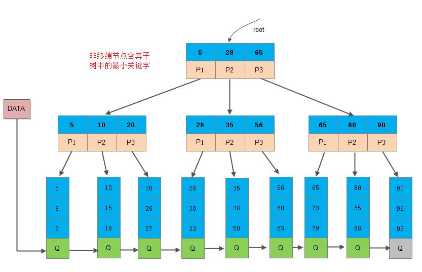

# 一、C++
## 1、C++语言基础
### **指针和引用的区别**
* 指针是一个新的变量，指向另一个变量的地址，我们可以通过访问这个地址来修改另一个变量
引用是一个别名，对引用的操作就是对变量的本身进行操作
* 指针可以有多级
引用只有一级
* 传参的时候，使用指针的话需要解引用才能对参数进行修改
使用引用可以直接对参数进行修改
* 指针的大小一般是4个字节
引用的大小取决于被引用对象的大小（指的是使用sizeof运算符得到的结果，引用本质上还是使用指针，因此所占内存和指针是一样的）
* 指针可以为空
引用不可以。

### **在函数参数传递的时候，什么时候使用指针，什么时候使用引用**
* 需要返回函数内局部变量的内存的时候用指针。使用指针传参需要开辟内存，用完要记得释放指针，不然会内存泄漏。而返回局部变量的引用是没有意义的
* 对栈空间大小比较敏感（比如递归）的时候使用引用。使用引用传递不需要创建临时变量，开销要更小
* 类对象作为参数传递的时候使用引用，这是C++类对象传递的标准方式
### **堆和栈有什么区别**
* 从定义上：堆是由new和malloc开辟的一块内存，由程序员手动管理，栈是编译器自动管理的内存，存放函数的参数和局部变量。
* 堆空间因为会有频繁的分配释放操作，会产生内存碎片
* 堆的生长空间向上，地址越来越大，栈的生长空间向下，地址越来越小
### **堆快一点还是栈快一点？（字节提前批一面）**
* 栈快一点。因为操作系统会在底层对栈提供支持，会分配专门的寄存器存放栈的地址，栈的入栈出栈操作也十分简单，并且有专门的指令执行，所以栈的效率比较高也比较快。而堆的操作是由C/C++函数库提供的，在分配堆内存的时候需要一定的算法寻找合适大小的内存。并且获取堆的内容需要两次访问，第一次访问指针，第二次根据指针保存的地址访问内存，因此堆比较慢。
### **new和delete是如何实现的，new 与 malloc的异同处**
* 在new一个对象的时候，首先会调用malloc为对象分配内存空间，然后调用对象的构造函数。delete会调用对象的析构函数，然后调用free回收内存。
* new与malloc都会分配空间，但是new还会调用对象的构造函数进行初始化，malloc需要给定空间大小，而new只需要对象名
### **linux下brk、mmap、malloc和new的区别**
* brk是系统调用，主要工作是实现虚拟内存到内存的映射，可以让进程的堆指针增长一定的大小，逻辑上消耗掉一块虚拟地址空间，malloc向OS获取的内存大小比较小时，将直接通过brk调用获取虚拟地址。
* mmap是系统调用，也是实现虚拟内存到内存的映射，可以让进程的虚拟地址区间切分出一块指定大小的虚拟地址空间vma_struct，一个进程的所有动态库文件.so的加载，都需要通过mmap系统调用映射指定大小的虚拟地址区间，被mmap映射返回的虚拟地址，逻辑上被消耗了，直到用户进程调用unmap，会回收回来。malloc向系统获取比较大的内存时，会通过mmap直接映射一块虚拟地址区间。
* malloc是C语言标准库中的函数，主要用于申请动态内存的分配，其原理是当堆内存不够时，通过brk/mmap等系统调用向内核申请进程的虚拟地址区间，如果堆内部的内存能满足malloc调用，则直接从堆里获取地址块返回。
* new是C++内置操作符，用于申请动态内存的分配，并同时进行初始化操作。其实现会调用malloc，对于基本类型变量，它只是增加了一个cookie结构, 比如需要new的对象大小是 object_size, 则事实上调用 malloc 的参数是 object_size + cookie， 这个cookie 结构存放的信息包括对象大小，对象前后会包含两个用于检测内存溢出的变量，所有new申请的cookie块会链接成双向链表。 对于自定义类型，new会先申请上述的大小空间，然后调用自定义类型的构造函数，对object所在空间进行构造。
### **既然有了malloc/free，C++中为什么还需要new/delete呢**
* 详见：https://blog.csdn.net/leikun153/article/details/80612130
* malloc/free和new/delete都是用来申请内存和回收内存的。
* 在对非基本数据类型的对象使用的时候，对象创建的时候还需要执行构造函数，销毁的时候要执行析构函数。而malloc/free是库函数，是已经编译的代码，所以不能把构造函数和析构函数的功能强加给malloc/free。
### **C和C++的区别**
* C是面向过程的语言，C++是面向对象的语言，C++有“封装，继承和多态”的特性。封装隐藏了实现细节，使得代码模块化。继承通过子类继承父类的方法和属性，实现了代码重用。多态则是“一个接口，多个实现”，通过子类重写父类的虚函数，实现了接口重用。
* C和C++内存管理的方法不一样，C使用malloc/free，C++除此之外还用new/delete
* C++中还有函数重载和引用等概念，C中没有
### **delete和delete[]的区别**
* 详见：https://cloud.tencent.com/developer/article/1727225
* delete只会调用一次析构函数，而delete[]会调用每个成员的析构函数
* 用new分配的内存用delete释放，用new[]分配的内存用delete[]释放
### **C++、Java的联系与区别，包括语言特性、垃圾回收、应用场景等（java的垃圾回收机制）**
* C++ 和Java都是面向对象的语言，C++是编译成可执行文件直接运行的，JAVA是编译之后在JAVA虚拟机上运行的，因此JAVA有良好的跨平台特性，但是执行效率没有C++ 高。
* C++的内存管理由程序员手动管理，JAVA的内存管理是由Java虚拟机完成的，它的垃圾回收使用的是标记-回收算法
* C++有指针，Java没有指针，只有引用
* JAVA和C++都有构造函数，但是C++有析构函数但是Java没有
### **C++和python的区别**
* python是一种脚本语言，是解释执行的，而C++是编译语言，是需要编译后在特定平台运行的。python可以很方便的跨平台，但是效率没有C++高。
* python使用缩进来区分不同的代码块，C++使用花括号来区分
* C++中需要事先定义变量的类型，而python不需要，python的基本数据类型只有数字，布尔值，字符串，列表，元组等等
* python的库函数比C++的多，调用起来很方便
### **struct和class的区别**
* 使用struct时，它的成员的访问权限默认是public的，而class的成员默认是private的
* struct的继承默认是public继承，而class的继承默认是private继承
* class可以用作模板，而struct不能
### **define 和const的联系与区别（编译阶段、安全性、内存占用等）**
* 联系：它们都是定义常量的一种方法。
* 区别：
    * define定义的常量没有类型，只是进行了简单的替换，可能会有多个拷贝，占用的内存空间大，const定义的常量是有类型的，存放在静态存储区，只有一个拷贝，占用的内存空间小。
    * define定义的常量是在预处理阶段进行替换，而const在编译阶段确定它的值。
    * define不会进行类型安全检查，而const会进行类型安全检查，安全性更高。
    * const可以修饰函数而define不可以。
* effective c++中给出的建议：
    * 对于单纯常量，最好以const对象或enums替换#define
    * 对于类型函数的宏，最好改用inline函数替换#define
### **在C++中const的用法（定义，用途）**
* const修饰类的成员变量时，表示常量不能被修改
* const修饰类的成员函数，表示该函数不会修改类中的数据成员，不会调用其他非const的成员函数

### **C++中的static用法和意义**
* 详解：[c++中static的用法详解](https://blog.csdn.net/majianfei1023/article/details/45290467)
[C++内存空间：静态存储区、栈、堆、文字常量区、程序代码区](https://blog.csdn.net/qq_43152052/article/details/98889139)
* static的意思是静态的，可以用来修饰变量，函数和类成员。
* 变量：被static修饰的变量就是静态变量，它会在程序运行过程中一直存在，会被放在静态存储区。局部静态变量的作用域在函数体中，全局静态变量的作用域在这个文件里。
* 函数：被static修饰的函数就是静态函数，静态函数只能在本文件中使用，不能被其他文件调用，也不会和其他文件中的同名函数冲突。
* 类：而在类中，被static修饰的成员变量是类静态成员，这个静态成员会被类的多个对象共用。被static修饰的成员函数也属于静态成员，不是属于某个对象的，访问这个静态函数不需要引用对象名，而是通过引用类名来访问。普通成员函数可以访问所有成员（包括成员变量和成员函数），静态成员函数只能访问静态成员。
* 注意static和const的区别。const强调值不能被修改，而static强调唯一的拷贝，对所有类的对象都共用。
### **全局静态变量和局部静态变量**
* 全局静态变量
    * 定义：在全局变量之前加上关键字static，全局变量就被定义成为一个全局静态变量。
    * 内存中的位置：静态存储区（静态存储区在整个程序运行期间都存在）
    * 初始化：未经初始化的全局静态变量会被程序自动初始化为0（自定义对象的值是任意的，除非它被显示初始化）
    * 作用域：全局静态变量在声明它的文件之外是不可见的。
    * 优点：
        * 不会被其他文件所访问，修改；
        * 其他文件中可以使用相同名字的变量，不会发生冲突。
* 局部静态变量：
    * 定义：在局部变量之前加上关键字static，局部变量就被定义成为一个局部静态变量。
    * 内存中的位置：静态存储区
    * 初始化：未经初始化的局部静态变量会被程序自动初始化为0（自定义对象的值是任意的，除非他被显示初始化）
    * 作用域：作用域仍为局部作用域，当定义它的函数或者语句块结束的时候，作用域随之结束。
* 注意：当static用来修饰局部变量的时候，它就改变了局部变量的存储位置，从原来的栈中存放改为静态存储区。但是局部静态变量在离开作用域之后，并没有被销毁，而是仍然驻留在内存当中，直到程序结束，只不过我们不能再对它进行访问。
当static用来修饰全局变量的时候，它就改变了全局变量的作用域（在声明它的文件之外是不可见的），但是没有改变它的存放位置，还是在静态存储区中。
### **计算下面几个类的大小**
```C++
class A {};
int main(){
  cout<<sizeof(A)<<endl;// 输出 1;
  A a; 
  cout<<sizeof(a)<<endl;// 输出 1;
  return 0;
}

```
* 空类的大小是1， 在C++中空类会占一个字节，这是为了让对象的实例能够相互区别。具体来说，空类同样可以被实例化，并且每个实例在内存中都有独一无二的地址，因此，编译器会给空类隐含加上一个字节，这样空类实例化之后就会拥有独一无二的内存地址。当该空白类作为基类时，该类的大小就优化为0了，子类的大小就是子类本身的大小。这就是所谓的空白基类最优化。

* 空类的实例大小就是类的大小，所以sizeof(a)=1字节,如果a是指针，则sizeof(a)就是指针的大小，即4字节。
```C++
class A { virtual Fun(){} };
int main(){
  cout<<sizeof(A)<<endl;// 输出 4(32位机器)/8(64位机器);
  A a; 
  cout<<sizeof(a)<<endl;// 输出 4(32位机器)/8(64位机器);
  return 0;
}
```
* 因为有虚函数的类对象中都有一个虚函数表指针 __vptr，其大小是4字节
```C++
class A { 
    static int a; 
    void Fun();
};
int main(){
  cout<<sizeof(A)<<endl;// 输出 1;
  A a; 
  cout<<sizeof(a)<<endl;// 输出 1;
  return 0;
}
```
* 静态成员存放在静态存储区，不占用类的大小, 普通函数也不占用类大小
```C++
class A { int a; };
int main(){
  cout<<sizeof(A)<<endl;// 输出 4;
  A a; 
  cout<<sizeof(a)<<endl;// 输出 4;
  return 0;
}
```
```C++
class A { static int a; int b; };;
int main(){
  cout<<sizeof(A)<<endl;// 输出 4;
  A a; 
  cout<<sizeof(a)<<endl;// 输出 4;
  return 0;
}
```
* 静态成员a不占用类的大小，所以类的大小就是b变量的大小 即4个字节
### **定义和声明的区别**
* 声明是告诉编译器变量的类型和名字，不会为变量分配空间
* 定义就是对这个变量和函数进行内存分配和初始化。需要分配空间，同一个变量可以被声明多次，但是只能被定义一次
### **typdef和define区别**
* #define是预处理命令，在预处理时执行简单的替换，不做正确性的检查
* typedef是在编译时处理的，它是在自己的作用域内给已经存在的类型一个别名
### **被free回收的内存是立即返还给操作系统吗？为什么**
* 不是的，被free回收的内存会首先被ptmalloc使用双链表保存起来，当用户下一次申请内存的时候，会尝试从这些内存中寻找合适的返回。这样就避免了频繁的系统调用，占用过多的系统资源。同时ptmalloc也会尝试对小块内存进行合并，避免过多的内存碎片。
### **引用作为函数参数以及返回值的好处**
* 对比值传递，引用传参的好处：
    * 在函数内部可以对此参数进行修改
    * 提高函数调用和运行的效率（因为没有了传值和生成副本的时间和空间消耗）
    * 用引用作为返回值最大的好处就是在内存中不产生被返回值的副本。
* 但是有以下的限制：
    * 不能返回局部变量的引用。因为函数返回以后局部变量就会被销毁
    * 不能返回函数内部new分配的内存的引用。虽然不存在局部变量的被动销毁问题，可对于这种情况（返回函数内部new分配内存的引用），又面临其它尴尬局面。例如，被函数返回的引用只是作为一个临时变量出现，而没有被赋予一个实际的变量，那么这个引用所指向的空间（由new分配）就无法释放，造成内存泄露
    * 可以返回类成员变量的引用，但是最好是const。因为如果其他对象可以获得该属性的非常量的引用，那么就可以修改该类成员变量的值，破坏了类的封装性。
### **友元函数和友元类**
* 详见：[友元(友元函数、友元类和友元成员函数) C++](https://www.cnblogs.com/zhuguanhao/p/6286145.html)
* 友元提供了不同类的成员函数之间、类的成员函数和一般函数之间进行数据共享的机制。通过友元，一个普通函数或者另一个类中的成员函数可以访问类中的私有成员和保护成员。友元的正确使用能提高程序的运行效率，但同时也破坏了类的封装性和数据的隐藏性，导致程序可维护性变差。
### **说一下volatile关键字的作用**
* volatile的意思是“脆弱的”，表明它修饰的变量的值十分容易被改变，所以编译器就不会对这个变量进行优化（CPU的优化是让该变量存放到CPU寄存器而不是内存），进而提供稳定的访问。每次读取volatile的变量时，系统总是会从内存中读取这个变量，并且将它的值立刻保存。
### **为什么C++没有实现垃圾回收？**
* 首先，实现一个垃圾回收器会带来额外的空间和时间开销。你需要开辟一定的空间保存指针的引用计数和对他们进行标记mark。然后需要单独开辟一个线程在空闲的时候进行free操作。
* 垃圾回收会使得C++不适合进行很多底层的操作。
### **有一个类A，里面有个类B类型的b，还有一个B类型的*b，什么情况下要用到前者，什么情况下用后者？**
* 一个具体的类对象和一个类对象的指针，主要差别就是占据的内存大小和读写速度。类对象占据的内存大，但是读写速度快。类对象指针内存小，但是读写需要解引用。所以可知，以搜索为主的场景中，应当使用类对象。以插入删除为主的场景中，应当使用类对象指针。
## 2、STL
### **C++的STL介绍（这个系列也很重要，建议侯捷老师的这方面的书籍与视频），其中包括内存管理allocator，函数，实现机理，多线程实现等**
* C++ STL从广义来讲包括了三类：算法，容器和迭代器。
    * 算法包括排序，复制等常用算法，以及不同容器特定的算法。
    * 容器就是数据的存放形式，包括序列式容器和关联式容器，序列式容器就是list，vector等，关联式容器就是set，map等。
    * 迭代器就是在不暴露容器内部结构的情况下对容器的遍历。
### **STL中的sort()算法是用什么实现的，stable_sort()呢**
* STL中的sort是用快速排序和插入排序结合的方式实现的，stable_sort()是归并排序。
### **迭代器失效吗？什么情况下会迭代器失效？**
* [【C++ STL】迭代器失效的几种情况总结](https://www.cnblogs.com/linuxAndMcu/p/14621819.html)
* 迭代器的失效问题：对容器的操作影响了元素的存放位置，称为迭代器失效。
* 如果容器扩容，在其他地方重新又开辟了一块内存。原来容器底层的内存上所保存的迭代器全都失效了。
* 对于序列式容器(如vector,deque)，序列式容器就是数组式容器，删除当前的iterator会使后面所有元素的iterator都失效。这是因为vetor,deque使用了连续分配的内存，删除一个元素导致后面所有的元素会向前移动一个位置。
* 对于关联容器(如 map, set,multimap,multiset)，删除当前的 iterator，仅仅会使当前的 iterator 失效，只要在 erase 时，递增当前 iterator 即可。这是因为 map 之类的容器，使用了红黑树来实现，插入、删除一个结点不会对其他结点造成影响。erase 迭代器只是被删元素的迭代器失效，但是返回值为 void，所以要采用erase(iter++)的方式删除迭代器。
* 对于链表式容器(如 list)，删除当前的 iterator，仅仅会使当前的 iterator 失效，这是因为 list 之类的容器，使用了链表来实现，插入、删除一个结点不会对其他结点造成影响。只要在 erase 时，递增当前 iterator 即可，并且 erase 方法可以返回下一个有效的 iterator。
### **STL源码中的hash表的实现**
* [map/unordered_map原理和使用整理](https://blog.csdn.net/Blues1021/article/details/45054159)
* STL中的hash表就unordered_map。使用的是哈希进行实现（注意与map的区别）。它记录的键是元素的哈希值，通过对比元素的哈希值来确定元素的值。
* unordered_map的底层实现是hashtable，采用开链法（也就是用桶）来解决哈希冲突。
### **解决哈希冲突的方式**
* 开放地址方法:当发生地址冲突时，按照某种方法继续探测哈希表中的其他存储单元，直到找到空位置为止。
    * 线性探测：按顺序决定值时，如果某数据的值已经存在，则在原来值的基础上往后加一个单位，直至不发生哈希冲突。　
    * 平方探测：按顺序决定值时，如果某数据的值已经存在，则在原来值的基础上先加1的平方个单位，若仍然存在则减1的平方个单位。随之是2的平方，3的平方等等。直至不发生哈希冲突。
    * 伪随机探测：按顺序决定值时，如果某数据已经存在，通过随机函数随机生成一个数，在原来值的基础上加上随机数，直至不发生哈希冲突。
* 链式地址法：对于相同的值，使用链表进行连接。使用数组存储每一个链表。
    * 优点：
        * 拉链法处理冲突简单，且无堆积现象，即非同义词决不会发生冲突，因此平均查找长度较短；
        * 由于拉链法中各链表上的结点空间是动态申请的，故它更适合于造表前无法确定表长的情况；
        * 开放定址法为减少冲突，要求装填因子α较小，故当结点规模较大时会浪费很多空间。而拉链法中可取α≥1，且结点较大时，拉链法中增加的指针域可忽略不计，因此节省空间；
        * 在用拉链法构造的散列表中，删除结点的操作易于实现。只要简单地删去链表上相应的结点即可。
    * 缺点：
        * 指针占用较大空间时，会造成空间浪费，若空间用于增大散列表规模进而提高开放地址法的效率。
* 再哈希法：当发生哈希冲突时使用另一个哈希函数计算地址值，直到冲突不再发生。这种方法不易产生聚集，但是增加计算时间，同时需要准备许多哈希函数。
* 建立公共溢出区：采用一个溢出表存储产生冲突的关键字。如果公共溢出区还产生冲突，再采用处理冲突方法处理。
### **STL中unordered_map和map的区别**
* unordered_map是使用哈希实现的，占用内存比较多，查询速度比较快，是常数时间复杂度。它内部是无序的，需要实现==操作符。
* map底层是采用红黑树实现的，插入删除查询时间复杂度都是O(log(n))，它的内部是有序的，因此需要实现比较操作符(<)。
### **STL中vector的实现**
* STL中的vector是封装了动态数组的顺序容器。不过与动态数组不同的是，vector可以根据需要自动扩大容器的大小。具体策略是每次容量不够用时重新申请一块大小为原来容量两倍的内存，将原容器的元素拷贝至新容器，并释放原空间，返回新空间的指针。
* 在原来空间不够存储新值时，每次调用push_back方法都会重新分配新的空间以满足新数据的添加操作。如果在程序中频繁进行这种操作，还是比较消耗性能的。
### **vector使用的注意点及其原因，频繁对vector调用push_back对性能的影响和原因**
* 如果需要频繁插入，最好先指定vector的大小，因为vector在容器大小不够用的时候会重新申请一块大小为原容器两倍的空间，并将原容器的元素拷贝到新容器中，并释放原空间，这个过程是十分耗时和耗内存的。频繁调用push_back会使得程序花费很多时间在vector扩容上，会变得很慢。这种情况可以考虑使用list。
### **C++中vector和list的区别**
* vector和数组类似，拥有一段连续的内存空间。vector申请的是一段连续的内存，当插入新的元素内存不够时，通常以2倍重新申请更大的一块内存，将原来的元素拷贝过去，释放旧空间。因为内存空间是连续的，所以在进行插入和删除操作时，会造成内存块的拷贝，时间复杂度为o(n)。
* list是由双向链表实现的，因此内存空间是不连续的。只能通过指针访问数据，所以list的随机存取非常没有效率，时间复杂度为o(n); 但由于链表的特点，能高效地进行插入和删除。
* vector拥有一段连续的内存空间，能很好的支持随机存取，因此vector::iterator支持“+”，“+=”，“<”等操作符。
* list的内存空间可以是不连续，它不支持随机访问，因此list::iterator则不支持“+”、“+=”、“<”等
* vector::iterator和list::iterator都重载了“++”运算符。
* 总之，如果需要高效的随机存取，而不在乎插入和删除的效率，使用vector;
* 如果需要大量的插入和删除，而不关心随机存取，则应使用list。
### **string的底层实现**
* string继承自basic_string,其实是对char进行了封装，封装的string包含了char数组，容量，长度等等属性。
* string可以进行动态扩展，在每次扩展的时候另外申请一块原空间大小两倍的空间（2*n），然后将原字符串拷贝过去，并加上新增的内容。
### **set，map和vector的插入复杂度**
* map, set, multimap, and multiset
上述四种容器采用红黑树实现，红黑树是平衡二叉树的一种。不同操作的时间复杂度近似为:
插入: O(logN)
查看:O(logN)
删除:O(logN)
* hash_map, hash_set, hash_multimap, and hash_multiset
上述四种容器采用哈希表实现，不同操作的时间复杂度为：
插入:O(1)，最坏情况O(N)。
查看:O(1)，最坏情况O(N)。
删除:O(1)，最坏情况O(N)。
* vector的复杂度
查看：O（1）
插入：O（N）
删除：O（N）
* list复杂度
查看：O（N）
插入：O（1）
删除：O（1）
### **set、map特性与区别**
* set：set是一种关联式容器，特性如下：
    * set低层以红黑树为低层容器；（低层实现：红黑树）
    * 所得元素的只有key没有value，value就是key；
    * 不允许出现键值重复；
    * 所有元素都会被自动排序
    * 不能通过迭代器来改变set的值，因为set的值就是键
* map：map是一种关联式容器，特性如下：
    * map以红黑树作为底层容器（低层实现：红黑树）
    * 所有元素都是键key+值value存在
    * 不允许键key重复
    * 所有元素是通过键进行自动排序的
    * map的键是不能修改的，但是其键对应的值是可以修改的
### **map、set为什么要用红黑树实现**
* 红黑树是一种二叉查找树，但在每个节点上增加一个存储为用于表示节点的颜色，可以是红或者黑。通过对任何一条从根到叶子节点的路径上各个节点的着色方式的限制，红黑树确保没有一条路径会比其他路径长出两倍，因此，红黑树是一种弱平衡树，但又相对与要求严格的AVL树来说，他的旋转次数较少，所以对于搜索，插入，删除操作比较多的情况下，通常使用红黑树。
### **vector用swap来缩减空间**
* 容器v1只有两个元素，却有着很大的容量，会造成存储浪费。所以我们
（1）用v1初始化一个临时对象，临时对象会根据v1的元素个数进行初始化；
（2）交换临时对象和v1；
（3）临时对象交换后销毁，v1原来的空间也销毁了；v1就指向现在的空间，明显占用空间减少。
## 3、C++特性
### **C++中的重载和重写的区别**
* 重载（overload）是指函数名相同，参数列表不同的函数实现方法。它们的返回值可以不同，但返回值不可以作为区分不同重载函数的标志。
* 重写（overwide）是指函数名相同，参数列表相同，只有方法体不相同的实现方法。一般用于子类继承父类时对父类方法的重写。子类的同名方法屏蔽了父类方法的现象称为隐藏。
### **C ++内存管理（热门问题）**
* 在C++中，内存分成5个区，他们分别是堆、栈、全局/静态存储区和常量存储区和代码区。
* 栈，在执行函数时，函数内局部变量的存储单元都可以在栈上创建，函数执行结束时这些存储单元自动被释放。栈内存分配运算内置于处理器的指令集中，效率很高，但是分配的内存容量有限。
* 堆，就是那些由new分配的内存块，他们的释放编译器不去管，由我们的应用程序去控制，一般一个new就要对应一个delete。如果程序员没有释放掉，那么在程序结束后，操作系统会自动回收。
* 全局/静态存储区，内存在程序编译的时候就已经分配好，这块内存在程序的整个运行期间都存在。它主要存放静态数据（局部static变量，全局static变量）、全局变量和常量。
* 常量存储区，这是一块比较特殊的存储区，他们里面存放的是常量字符串，不允许修改。
* 代码区，存放程序的二进制代码
### **介绍面向对象的三大特性，并且举例说明每一个**
* 面向对象的三大特性是：封装，继承和多态。
* 封装隐藏了类的实现细节和成员数据，实现了代码模块化，如类里面的private和public；
* 继承使得子类可以复用父类的成员和方法，实现了代码重用；
* 多态则是“一个接口，多个实现”，通过父类调用子类的成员，实现了接口重用，如父类的指针指向子类的对象。
### **函数重载的时候怎么解决同名冲突**
* 对于C++，同名函数会根据参数类型和数量的不同，编译成不同的函数名，这样在链接阶段就可以正确的区分，从而实现重载。
### **多态的实现（和下个问题一起回答）**
* C++ 多态包括编译时多态和运行时多态，编译时多态体现在函数重载和模板上，运行时多态体现在虚函数上。
* 虚函数：在基类的函数前加上virtual关键字，在派生类中重写该函数，运行时将会根据对象的实际类型来调用相应的函数。如果对象类型是派生类，就调用派生类的函数；如果对象类型是基类，就调用基类的函数.
### **C++虚函数相关（虚函数表，虚函数指针），虚函数的实现原理（热门，重要）**
* 详见：[C++虚函数表剖析](https://leehao.me/C-%E8%99%9A%E5%87%BD%E6%95%B0%E8%A1%A8%E5%89%96%E6%9E%90/)
* C++的虚函数是实现多态的机制。它是通过虚函数表实现的，虚函数表是每个类中存放虚函数地址的指针数组，类的实例在调用函数时会在虚函数表中寻找函数地址进行调用，如果子类覆盖了父类的函数，则子类的虚函数表会指向子类实现的函数地址，否则指向父类的函数地址。一个类的所有实例都共享同一张虚函数表。
* 虚表指针放在类的开头。通过对虚表指针的解引用找到虚表。
* 虚表是一个指针数组，其元素是虚函数的指针，每个元素对应一个虚函数的函数指针。需要指出的是，普通的函数即非虚函数，其调用并不需要经过虚表，所以虚表的元素并不包括普通函数的函数指针。
虚表内的条目，即虚函数指针的赋值发生在编译器的编译阶段，也就是说在代码的编译阶段，虚表就可以构造出来了。
* 虚表是属于类的，而不是属于某个具体的对象，一个类只需要一个虚表即可。同一个类的所有对象都使用同一个虚表。
* 为了指定对象的虚表，对象内部包含一个虚表的指针，来指向自己所使用的虚表。为了让每个包含虚表的类的对象都拥有一个虚表指针，编译器在类中添加了一个指针，*__vptr，用来指向虚表。这样，当类的对象在创建时便拥有了这个指针，且这个指针的值会自动被设置为指向类的虚表。
* 上面指出，一个继承类的基类如果包含虚函数，那个这个继承类也有拥有自己的虚表，故这个继承类的对象也包含一个虚表指针，用来指向它的虚表。
* 对象的虚表指针用来指向自己所属类的虚表，虚表中的指针会指向其继承的最近的一个类的虚函数
* 如果多重继承和多继承的话，子类的虚函数表长什么样子？
    * 详见：[C++多态虚函数表详解(多重继承、多继承情况)](https://blog.csdn.net/qq_36359022/article/details/81870219)
    * 在多继承情况下，有多少个基类就有多少个虚函数表指针，前提是基类要有虚函数才算上这个基类。
    * 当有多个虚函数表时，虚函数表的结果是0代表没有下一个虚函数表。
    * 子类虚函数会覆盖每一个父类的每一个同名虚函数。
    * 父类中没有的虚函数而子类有，填入第一个虚函数表中，且用父类指针是不能调用。
    * 父类中有的虚函数而子类没有，则不覆盖。仅子类和该父类指针能调用。
### **编译器处理虚函数**
* 如果类中有虚函数，就将虚函数的地址记录在类的虚函数表中。派生类在继承基类的时候，如果有重写基类的虚函数，就将虚函数表中相应的函数指针设置为派生类的函数地址，否则指向基类的函数地址。
为每个类的实例添加一个虚表指针（vptr），虚表指针指向类的虚函数表。实例在调用虚函数的时候，通过这个虚函数表指针找到类中的虚函数表，找到相应的函数进行调用。
### **基类的析构函数一般写成虚函数的原因**
* 首先析构函数可以为虚函数，当析构一个指向子类的父类指针时，编译器可以根据虚函数表寻找到子类的析构函数进行调用，从而正确释放子类对象的资源。
* 如果析构函数不被声明成虚函数，则编译器实施静态绑定，在删除指向子类的父类指针时，只会调用父类的析构函数而不调用子类析构函数，这样就会造成子类对象析构不完全造成内存泄漏。
### **构造函数为什么不能定义为虚函数**
* 因为创建一个对象时需要确定对象的类型，而虚函数是在运行时确定其类型的。而在构造一个对象时，由于对象还未创建成功，编译器无法知道对象的实际类型，是类本身还是类的派生类等等
* 虚函数的调用需要虚函数表指针，而该指针存放在对象的内存空间中；若构造函数声明为虚函数，那么由于对象还未创建，还没有内存空间，更没有虚函数表地址用来调用虚函数即构造函数了
### **构造函数或者析构函数中调用虚函数会怎样**
* 详见：[构造函数和析构函数中可以调用调用虚函数吗](https://www.cnblogs.com/sylar5/p/11523992.html)
* 父类构造函数中调用的虚函数仍然是父类版本的函数，子类中调用的仍然是子类版本的函数。
* 如果有继承，构造函数会先调用父类构造函数，而如果构造函数中有虚函数，此时子类还没有构造，所以此时的对象还是父类的，不会触发多态。
* 析构函数也是一样，子类先进行析构，这时，如果有virtual函数的话，子类的内容已经被析构了，C++会视其父类，执行父类的virtual函数。
### **纯虚函数**
* 纯虚函数是只有声明没有实现的虚函数，是对子类的约束，是接口继承
* 包含纯虚函数的类是抽象类，它不能被实例化，只有实现了这个纯虚函数的子类才能生成对象
* 使用场景：当这个类本身产生一个实例没有意义的情况下，把这个类的函数实现为纯虚函数，比如动物可以派生出老虎兔子，但是实例化一个动物对象就没有意义。并且可以规定派生的子类必须重写某些函数的情况下可以写成纯虚函数。
### **静态绑定和动态绑定的介绍**
* 详见：[C++中的静态绑定和动态绑定](https://www.cnblogs.com/lizhenghn/p/3657717.html)
* 静态类型：对象在声明时采用的类型，在编译期既已确定；
* 动态类型：通常是指一个指针或引用目前所指对象的类型，是在运行期决定的；
* 静态绑定：绑定的是静态类型，所对应的函数或属性依赖于对象的静态类型，发生在编译期；
* 动态绑定：绑定的是动态类型，所对应的函数或属性依赖于对象的动态类型，发生在运行期；
### **深拷贝和浅拷贝的区别（举例说明深拷贝的安全性）**
* 浅拷贝就是将对象的指针进行简单的复制，原对象和副本指向的是相同的资源。
* 而深拷贝是新开辟一块空间，将原对象的资源复制到新的空间中，并返回该空间的地址。
* 深拷贝可以避免重复释放和写冲突。例如使用浅拷贝的对象进行释放后，对原对象的释放会导致内存泄漏或程序崩溃。
### **对象复用的了解，零拷贝的了解**
* 对象复用指得是设计模式，对象可以采用不同的设计模式达到复用的目的，最常见的就是继承和组合模式了。
* 零拷贝指的是在进行操作时，避免CPU从一处存储拷贝到另一处存储。在Linux中，我们可以减少数据在内核空间和用户空间的来回拷贝实现，比如通过调用mmap()来代替read调用。
    >用程序调用mmap()，磁盘上的数据会通过DMA被拷贝的内核缓冲区，接着操作系统会把这段内核缓冲区与应用程序共享，这样就不需要把内核缓冲区的内容往用户空间拷贝。应用程序再调用write(),操作系统直接将内核缓冲区的内容拷贝到socket缓冲区中，这一切都发生在内核态，最后，socket缓冲区再把数据发到网卡去。

### **介绍C++所有的构造函数**
* C++中的构造函数主要有三种类型：默认构造函数、重载构造函数和拷贝构造函数
* 默认构造函数是当类没有实现自己的构造函数时，编译器默认提供的一个构造函数。
* 重载构造函数也称为一般构造函数，一个类可以有多个重载构造函数，但是需要参数类型或个数不相同。可以在重载构造函数中自定义类的初始化方式。
* 拷贝构造函数是在发生对象复制的时候调用的。 
### **什么情况下会调用拷贝构造函数**
* 详见：[C++拷贝构造函数详解](https://blog.csdn.net/lwbeyond/article/details/6202256)
* 对象以值传递的方式传入函数参数 
    >如 ` void func(Dog dog){};`
* 对象以值传递的方式从函数返回
    >如 ` Dog func(){ Dog d; return d;}`
* 对象需要通过另外一个对象进行初始化
* 用花括号列表初始化一个数组中的元素或一个聚合类中的成员
    >聚合类：所有成员都是public的、没有定义任何构造函数、没有类内初始值、没有基类也没有virtual函数。例如
    ```c++
    struct Data {
        int val;
        string s;
    };
    ```
### **结构体内存对齐方式和为什么要进行内存对齐？**
* 因为结构体的成员可以有不同的数据类型，所占的大小也不一样。同时，由于CPU读取数据是按块读取的，内存对齐可以使得CPU一次就可以将所需的数据读进来。
* 对齐规则：
    * 第一个成员在与结构体变量偏移量为0的地址
    * 其他成员变量要对齐到某个数字（对齐数）的整数倍的地址处。
    * 对齐数=编译器默认的一个对齐数 与 该成员大小的较小值。
    * 在32位机器下，GCC编译器默认按4字节对齐，64位机器下，GCC编译器默认按8字节对齐
* 结构体总大小为最大对齐数的整数倍（每个成员变量除了第一个成员都有一个对齐数）

### **内存泄露的定义，如何检测与避免？**
* 动态分配内存所开辟的空间，在使用完毕后未手动释放，导致一直占据该内存，即为内存泄漏。

* 造成内存泄漏的几种原因：
    * 类的构造函数和析构函数中new和delete没有配套
    * 在释放对象数组时没有使用delete[]，使用了delete

    * 没有将基类的析构函数定义为虚函数，当基类指针指向子类对象时，如果基类的析构函数不是virtual，那么子类的析构函数将不会被调用，子类的资源没有正确释放，因此造成内存泄露
    * 没有正确的清除嵌套的对象指针
* 避免方法：
    * malloc/free、new/delete、new[]/delete[]嵌套使用
    * 使用智能指针来管理内存
    * 将基类的析构函数设为虚函数
### **C++的智能指针有哪些**
* C++中的智能指针有auto_ptr,shared_ptr,weak_ptr和unique_ptr。智能指针其实是将指针进行了封装，可以像普通指针一样进行使用，同时可以自行进行释放，避免忘记释放指针指向的内存地址造成内存泄漏。
* auto_ptr是较早版本的智能指针，在进行指针拷贝和赋值的时候，新指针直接接管旧指针的资源并且将旧指针指向空，但是这种方式在需要访问旧指针的时候，就会出现问题。
* unique_ptr是auto_ptr的一个改良版，不能赋值也不能拷贝，保证一个对象同一时间只有一个智能指针。
* shared_ptr可以使得一个对象可以有多个智能指针，当这个对象所有的智能指针被销毁时就会自动进行回收。（内部使用计数机制进行维护）
* weak_ptr是为了协助shared_ptr而出现的。它不能访问对象，只能观测shared_ptr的引用计数，防止出现死锁。
* share_ptr原理：
shared_ptr是可以共享所有权的指针。如果有多个shared_ptr共同管理同一个对象时，只有这些shared_ptr全部与该对象脱离关系之后，被管理的对象才会被释放。
shared_ptr的管理机制其实并不复杂，就是对所管理的对象进行了引用计数，当新增一个shared_ptr对该对象进行管理时，就将该对象的引用计数加一；减少一个shared_ptr对该对象进行管理时，就将该对象的引用计数减一，如果该对象的引用计数为0的时候，说明没有任何指针对其管理，才调用delete释放其所占的内存。
### **inline关键字说一下，内联函数和宏定义有什么区别**
* inline是内联的意思，可以定义比较小的函数。因为函数频繁调用会占用很多的栈空间，进行入栈出栈操作也耗费计算资源，所以可以用inline关键字修饰频繁调用的小函数。编译器会在编译阶段将代码体嵌入内联函数的调用语句块中。
* 内联函数和宏定义的区别：
    * 内联函数在编译时展开，而宏在预编译时展开。
    * 在编译的时候，内联函数直接被嵌入到目标代码中去，而宏只是一个简单的文本替换。
    * 内联函数可以进行诸如类型安全检查、语句是否正确等编译功能，宏不具有这样的功能。
    * 宏不是函数，而inline是函数。
    * 宏在定义时要小心处理宏参数，一般用括号括起来，否则容易出现二义性。而内联函数不会出现二义性。
    * inline可以不展开，宏一定要展开。因为inline指示对编译器来说，只是一个建议，编译器可以选择忽略该建议，不对该函数进行展开。
    * 宏定义在形式上类似于一个函数，但在使用它时，仅仅只是做预处理器符号表中的简单替换，因此它不能进行参数有效性的检测，也就不能享受C++编译器严格类型检查的好处，另外它的返回值也不能被强制转换为可转换的合适的类型，这样，它的使用就存在着一系列的隐患和局限性。
### **模板的用法与适用场景 实现原理**
* 详见：[C++ 模板应用浅析](https://blog.csdn.net/cyxisgreat/article/details/37957687)
### **成员初始化列表的概念，为什么用成员初始化列表会快一些（性能优势）？**
* 成员初始化列表就是在类或者结构体的构造函数中，在参数列表后以冒号开头，逗号进行分隔的一系列初始化字段。
    ```c++
    class A{
        int id;
        string name;
        FaceImage face;
        A(int& inputID,string& inputName,FaceImage& inputFace):id(inputID),name(inputName),face(inputFace){} // 成员初始化列表
    };
    ```
* 首先把数据成员按类型分类
    * 类型1：内置数据类型，复合类型（指针，引用）
    * 类型2：用户定义类型（类类型）
* 分情况说明：
    * 对于类型1，在成员初始化列表和构造函数体内进行，在性能和结果上都是一样的
    * 对于类型2，结果上相同，但是性能上存在很大的差别
    因为类类型的数据成员对象在进入函数体是已经构造完成，也就是说在成员初始化列表处进行构造对象的工作，这是调用一个构造函数，在进入函数体之后，进行的是对已经构造好的类对象的赋值，又调用个拷贝赋值操作符才能完成（如果并未提供，则使用编译器提供的默认按成员赋值行为）
* 简单的来说：
    * 对于用户定义类型：如果使用类初始化列表，直接调用对应的构造函数即完成初始化
    如果在构造函数中初始化，那么首先调用默认的构造函数，然后调用指定的构造函数
    所以对于用户定义类型，使用列表初始化可以减少一次默认构造函数调用过程
* 另外，有三种情况是必须使用成员初始化列表进行初始化的：
    * 常量成员的初始化，因为常量成员只能初始化不能赋值
    * 引用类型
    * 没有默认构造函数的对象必须使用成员初始化列表的方式进行初始化
### **C++的调用惯例（简单一点C++函数调用的压栈过程）**
* 函数的调用过程：
    * 从栈空间分配存储空间
    * 从实参的存储空间复制值到形参栈空间
    * 进行运算
* 形参在函数未调用之前都是没有分配存储空间的，在函数调用结束之后，形参弹出栈空间，清除形参空间。
* 数组作为参数的函数调用方式是地址传递，形参和实参都指向相同的内存空间，调用完成后，形参指针被销毁，但是所指向的内存空间依然存在，不能也不会被销毁。
* 当函数有多个返回值的时候，不能用普通的 return 的方式实现，需要通过传回地址的形式进行，即地址/指针传递
### **C++的四种强制转换**
* 四种强制类型转换操作符分别为：static_cast、dynamic_cast、const_cast、reinterpret_cast
* static_case(静态转换)：
    * 使用场景
        * 在基本数据类型之间转换，如把 int 转换为 char，这种带来安全性问题由程序员来保证；
        * 在有类型指针与 void * 之间转换；
        * 用于类层次结构中基类和派生类之间指针或引用的转换。
            * 上行转换（派生类---->基类）是安全的；
            * 下行转换（基类---->派生类）由于没有动态类型检查，所以是不安全的。
    * 使用特点
        * 主要执行非多态的转换操作，用于代替C中通常的转换操作。
        * 隐式转换都建议使用 static_cast 进行标明和替换。
        * 不能使用 static_cast 在有类型指针内转换。
* dynamic_cast(动态转换)：
    * 使用场景
        * 用于将一个父类的指针/引用转化为子类的指针/引用（下行转换）
    * 使用特点
        * 基类必须要有虚函数，因为 dynamic_cast 是运行时类型检查，需要运行时类型信息，而这个信息是存储在类的虚函数表中。
        * 对于下行转换，dynamic_cast 是安全的（当类型不一致时，转换过来的是空指针），而 static_cast 是不安全的。
        * 对指针进行 dynamic_cast，失败返回 NULL，成功返回正常 cast 后的对象指针；对引用进行 dynamic_cast，失败抛出一个异常，成功返回正常 cast 后的对象引用。
* const_cast(常量转换)：
    * 使用场景
        * 常量指针（或引用）与非常量指针（或引用）之间的转换。
    * 使用特点
        * cosnt_cast 是四种类型转换符中唯一可以对常量进行操作的转换符。
        * 去除常量性是一个危险的动作，尽量避免使用。
* reinterpret_cast(不相关类型的转换)：
    * 使用场景
        * 用在任意指针（或引用）类型之间的转换。
        * 能够将整型转换为指针，也可以把指针转换为整型或数组。
    * 使用特点
        * reinterpret_cast 是从底层对数据进行重新解释，依赖具体的平台，可移植性差。
        * 不到万不得已，不用使用这个转换符，高危操作。
## 4.调试程序
### **调试程序的方法**
* 通过设置断点进行调试
* 打印log进行调试
* 打印中间结果进行调试
### **遇到coredump要怎么调试**
* coredump是程序由于异常或者bug在运行时异常退出或者终止，在一定的条件下生成的一个叫做core的文件，这个core文件会记录程序在运行时的内存，寄存器状态，内存指针和函数堆栈信息等等。对这个文件进行分析可以定位到程序异常的时候对应的堆栈调用信息。
* 使用gdb命令对core文件进行调试

以下例子在Linux上编写一段代码并导致segment fault 并产生core文件
```
mkdir coredumpTest
vim coredumpTest.cpp
```
在编辑器内键入
```
#include <iostream>
using namespace std;

int main() {
    int *p = nullptr;
    *p = 0; // 给空指针指向的地址赋值，引发core dump
    return 0;
}
```
编译
```
g++ coredumpTest.cpp -g -o coredumpTest
```
运行
```
./coredumpTest
```
使用gdb调试coredump
```
gdb [可执行文件名] [core文件名]
```
### **一个函数或者可执行文件的生成过程或者编译过程是怎样的**
* 预处理、编译、汇编、链接
* 详见：[程序详细编译过程（预处理、编译、汇编、链接）](https://zhuanlan.zhihu.com/p/476697014)
* 预处理： 对预处理命令进行替换等预处理操作
    > gcc -E main.c -o main.i
    * 主要处理源代码文件中的以“#”开头的预编译指令。处理规则见下
    * 删除所有的#define，展开所有的宏定义。
    * 处理所有的条件预编译指令，如“#if”、“#endif”、“#ifdef”、“#elif”和“#else”。
    * 处理“#include”预编译指令，将文件内容替换到它的位置，这个过程是递归进行的，文件中包含其他文件。
    * 删除所有的注释，“//”和“/**/”。
    * 保留所有的#pragma 编译器指令，编译器需要用到他们，如：#pragma once 是为了防止有文件被重复引用。
    * 添加行号和文件标识，便于编译时编译器产生调试用的行号信息，和编译时产生编译错误或警告是能够显示行号。
* 编译：代码优化和生成汇编代码
    > gcc -S main.i -o main.s
    * 把预编译之后生成的xxx.i或xxx.ii文件，进行一系列词法分析、语法分析、语义分析及优化后，生成相应的汇编代码文件。
    * 词法分析：利用类似于“有限状态机”的算法，将源代码程序输入到扫描机中，将其中的字符序列分割成一系列的记号。
    * 语法分析：语法分析器对由扫描器产生的记号，进行语法分析，产生语法树。由语法分析器输出的语法树是一种以表达式为节点的树。
    * 语义分析：语法分析器只是完成了对表达式语法层面的分析，语义分析器则对表达式是否有意义进行判断，其分析的语义是静态语义——在编译期能分期的语义，相对应的动态语义是在运行期才能确定的语义。
    * 优化：源代码级别的一个优化过程。
    * 目标代码生成：由代码生成器将中间代码转换成目标机器代码，生成一系列的代码序列——汇编语言表示。
    * 目标代码优化：目标代码优化器对上述的目标机器代码进行优化：寻找合适的寻址方式、使用位移来替代乘法运算、删除多余的指令等。
* 汇编：将汇编代码转化为机器语言
    > gcc -c main.s -o main.o
    * 将汇编代码转变成机器可以执行的指令(机器码文件)。 汇编器的汇编过程相对于编译器来说更简单，没有复杂的语法，也没有语义，更不需要做指令优化，只是根据汇编指令和机器指令的对照表一一翻译过来，汇编过程有汇编器as完成。经汇编之后，产生目标文件
* 链接：将目标文件彼此链接起来
    > gcc  main.o   -o  main
    * 将不同的源文件产生的目标文件进行链接，从而形成一个可以执行的程序。链接分为静态链接和动态链接：
        * 静态链接：函数和数据被编译进一个二进制文件。在使用静态库的情况下，在编译链接可执行文件时，链接器从库中复制这些函数和数据并把它们和应用程序的其它模块组合起来创建最终的可执行文件。
            * 空间浪费：因为每个可执行程序中对所有需要的目标文件都要有一份副本，所以如果多个程序对同一个目标文件都有依赖，会出现同一个目标文件都在内存存在多个副本；
            * 更新困难：每当库函数的代码修改了，这个时候就需要重新进行编译链接形成可执行程序。
            *运行速度快：但是静态链接的优点就是，在可执行程序中已经具备了所有执行程序所需要的任何东西，在执行的时候运行速度快。
        * 动态链接：动态链接的基本思想是把程序按照模块拆分成各个相对独立部分，在程序运行时才将它们链接在一起形成一个完整的程序，而不是像静态链接一样把所有程序模块都链接成一个单独的可执行文件。
            * 共享库：就是即使需要每个程序都依赖同一个库，但是该库不会像静态链接那样在内存中存在多份副本，而是这多个程序在执行时共享同一份副本；
            * 更新方便：更新时只需要替换原来的目标文件，而无需将所有的程序再重新链接一遍。当程序下一次运行时，新版本的目标文件会被自动加载到内存并且链接起来，程序就完成了升级的目标。
            * 性能损耗：因为把链接推迟到了程序运行时，所以每次执行程序都需要进行链接，所以性能会有一定损失。
## 5、C++11新特性
* 详见：[c++11新特性，所有知识点都在这了！](https://zhuanlan.zhihu.com/p/139515439)
# 二、Linux系统编程和网络编程
### **Linux的I/O模型介绍以及同步异步阻塞非阻塞的区别（超级重要）**
详见：[IO同步、异步与多路复用](https://blog.csdn.net/sqsltr/article/details/92762279)
[同步IO、异步IO、阻塞IO、非阻塞IO之间的联系与区别](https://www.cnblogs.com/euphie/p/6376508.html)
* IO过程包括两个阶段：（1）内核从IO设备读写数据 （2）进程从内核复制数据
* 阻塞：调用IO操作的时候，如果缓冲区空或者满了，调用的进程或者线程就会处于阻塞状态直到IO可用并完成数据拷贝。
* 非阻塞：调用IO操作的时候，内核会马上返回结果，如果IO不可用，会返回错误，这种方式下进程需要不断轮询直到IO可用为止，但是当进程从内核拷贝数据时是阻塞的。
* IO多路复用就是同时监听多个描述符，一旦某个描述符IO就绪（读就绪或者写就绪），就能够通知进程进行相应的IO操作，否则就将进程阻塞在select或者epoll语句上。
* 同步IO：同步IO模型包括阻塞IO，非阻塞IO和IO多路复用。特点就是当进程从内核复制数据的时候都是阻塞的。
* 异步IO：在检测IO是否可用和进程拷贝数据的两个阶段都是不阻塞的，进程可以做其他事情，当IO完成后内核会给进程发送一个信号。
### **epoll的介绍和了解**
* epoll是Linux进行IO多路复用的一种方式，用于在一个线程里监听多个IO源，在IO源可用的时候返回并进行操作。它的特点是基于事件驱动，性能很高。
* epoll将文件描述符拷贝到内核空间后使用红黑树进行维护，同时向内核注册每个文件描述符的回调函数，当某个文件描述符可读可写的时候，将这个文件描述符加入到就绪链表里，并唤起进程，返回就绪链表到用户空间，由用户程序进行处理。
* epoll有三个系统调用：epoll_create(),epoll_ctl()和epoll_wait()。
    * eoll_create()函数在内核中初始化一个eventpoll对象，同时初始化红黑树和就绪链表。
    * epoll_ctl()用来对监听的文件描述符进行管理。将文件描述符插入红黑树，或者从红黑树中删除，这个过程的时间复杂度是log(N)。同时向内核注册文件描述符的回调函数。
    * epoll_wait()会将进程放到eventpoll的等待队列中，将进程阻塞，当某个文件描述符IO可用时，内核通过回调函数将该文件描述符放到就绪链表里，epoll_wait()会将就绪链表里的文件描述符返回到用户空间。
* epoll为什么高效：
    * select，poll实现需要自己不断轮询所有fd集合，直到设备就绪，期间可能要睡眠和唤醒多次交替。而epoll只要判断一下就绪链表是否为空就行了，这节省了大量的CPU时间。
    * select，poll每次调用都要把fd集合从用户态往内核态拷贝一次，并且要把当前进程往设备等待队列中挂一次，而epoll只要一次拷贝，而且把当前进程往等待队列上挂也只挂一次，这也能节省不少的开销。
### **IO复用的三种方法（select,poll,epoll）深入理解，包括三者区别，内部原理实现？**
* 详见：[select、poll、epoll之间的区别总结[整理]](https://www.cnblogs.com/Anker/p/3265058.html)
[select、poll、epoll之间的区别(搜狗面试)](https://www.cnblogs.com/aspirant/p/9166944.html)
* select==>时间复杂度O(n)
    * select的方法介绍：select把所有监听的文件描述符拷贝到内核中，挂起进程。当某个文件描述符可读或可写的时候，中断程序唤起进程，select将监听的文件描述符再次拷贝到用户空间，然select后遍历这些文件描述符找到IO可用的文件。下次监控的时候需要再次拷贝这些文件描述符到内核空间。select支持监听的描述符最大数量是1024.
    它仅仅知道了，有I/O事件发生了，却并不知道是哪那几个流（可能有一个，多个，甚至全部），我们只能无差别轮询所有流，找出能读出数据，或者写入数据的流，对他们进行操作。所以select具有O(n)的无差别轮询复杂度，同时处理的流越多，无差别轮询时间就越长。
    * 缺点：
        * 单个进程可监视的fd数量被限制，即能监听端口的大小有限。
        一般来说这个数目和系统内存关系很大，具体数目可以cat /proc/sys/fs/file-max察看。32位机默认是1024个。64位机默认是2048.
        * 对socket进行扫描时是线性扫描，即采用轮询的方法，效率较低：当套接字比较多的时候，每次select()都要通过遍历FD_SETSIZE个Socket来完成调度,不管哪个Socket是活跃的,都遍历一遍。这会浪费很多CPU时间。如果能给套接字注册某个回调函数，当他们活跃时，自动完成相关操作，那就避免了轮询，这正是epoll与kqueue做的。
        * 需要维护一个用来存放大量fd的数据结构，这样会使得用户空间和内核空间在传递该结构时复制开销大
* poll==>时间复杂度O(n)
    * poll使用链表保存文件描述符，其他的跟select没有什么不同。
    * poll本质上和select没有区别，它将用户传入的数组拷贝到内核空间，然后查询每个fd对应的设备状态， 但是它没有最大连接数的限制，原因是它是基于链表来存储的.
    * 缺点：
        * 大量的fd的数组被整体复制于用户态和内核地址空间之间，而不管这样的复制是不是有意义。
* epoll==>时间复杂度O(1)
    * epoll可以理解为event poll，不同于忙轮询和无差别轮询，epoll会把哪个流发生了怎样的I/O事件通知我们。所以我们说epoll实际上是事件驱动（每个事件关联上fd）的，此时我们对这些流的操作都是有意义的。（复杂度降低到了O(1)）
    * epoll将文件描述符拷贝到内核空间后使用红黑树进行维护，同时向内核注册每个文件描述符的回调函数，当某个文件描述符可读可写的时候，将这个文件描述符加入到就绪链表里，并唤起进程，返回就绪链表到用户空间。
    * 优点：
        * 没有最大并发连接的限制，能打开的FD的上限远大于1024（1G的内存上能监听约10万个端口）；
        * 效率提升，不是轮询的方式，不会随着FD数目的增加效率下降。只有活跃可用的FD才会调用callback函数；即Epoll最大的优点就在于它只管你“活跃”的连接，而跟连接总数无关，因此在实际的网络环境中，Epoll的效率就会远远高于select和poll。
        * 内存拷贝，利用mmap()文件映射内存加速与内核空间的消息传递；即epoll使用mmap减少复制开销。
### **epoll的ET模式和LT模式（ET的非阻塞）**
* ET是边缘触发模式，在这种模式下，只有当描述符从未就绪变成就绪时，内核才会通过epoll进行通知。然后直到下一次变成就绪之前，不会再次重复通知。也就是说，如果一次就绪通知之后不对这个描述符进行IO操作导致它变成未就绪，内核也不会再次发送就绪通知。优点就是只通知一次，减少内核资源浪费，效率高。缺点就是不能保证数据的完整，有些数据来不及读可能就会无法取出。
* LT是水平触发模式，在这个模式下，如果文件描述符IO就绪，内核就会进行通知，如果不对它进行IO操作，只要还有未操作的数据，内核都会一直进行通知。优点就是可以确保数据可以完整输出。缺点就是由于内核会一直通知，会不停从内核空间切换到用户空间，资源浪费严重。
### **coredump是什么 怎么才能coredump**
* coredump是程序由于异常或者bug在运行时异常退出或者终止，在一定的条件下生成的一个叫做core的文件，这个core文件会记录程序在运行时的内存，寄存器状态，内存指针和函数堆栈信息等等。对这个文件进行分析可以定位到程序异常的时候对应的堆栈调用信息。
* coredump产生的条件
    * shell资源控制限制，使用 ulimit -c 命令查看shell执行程序时的资源 ，如果为0，则不会产生coredump。可以用ulimit -c unlimited设置为不限大小。
    * 读写越界，包括：数组访问越界，指针指向错误的内存，字符串读写越界
    * 使用了线程不安全的函数，读写未加锁保护
    * 错误使用指针转换
    * 堆栈溢出
### **socket网络编程有哪些系统调用？其中close是一次就能直接关闭的吗，半关闭状态是怎么产生的？**
* 建立TCP服务器连接的过程中主要通过以下系统调用序列来获取某些函数，这些系统调用主要包括：
    ```
        socket()    创建套接字   
        bind()      绑定本机端口    
        connect()   建立连接     （TCP三次握手在调用这个函数时进行）
        listen()    监听端口
        accept()    接受连接
        recv(), read(), recvfrom()  数据接收
        send(), write(), sendto()   数据发送
        close(), shutdown() 关闭套接字
    ```
* 使用close()时，只有当套接字的引用计数为0的时候才会终止连接，而用shutdown()就可以直接关闭连接
### **详细说一下epoll、select、poll**
* [select、poll、epoll之间的区别比较](https://zhuanlan.zhihu.com/p/345762559)
* [如果这篇文章说不清epoll的本质，那就过来掐死我吧！ （1）](https://zhuanlan.zhihu.com/p/63179839)
* [如果这篇文章说不清epoll的本质，那就过来掐死我吧！ （2）](https://zhuanlan.zhihu.com/p/64138532)
* [如果这篇文章说不清epoll的本质，那就过来掐死我吧！ （3）](https://zhuanlan.zhihu.com/p/64746509)
# 三、计算机网络
## 1、TCP相关（大概）
### **介绍一下ping的过程，分别用到了哪些协议**
* ping通过ICMP协议来进行工作。ICMP：网络报文控制协议
* 首先，ping命令会构建一个ICMP请求数据包，然后由ICMP协议将这个数据包连同目的IP地址，源IP地址一起交给IP协议；
* 然后IP协议会构建一个IP数据包并在映射表中查找目的IP对应的下一跳MAC地址，如果映射表中没有IP地址对应的下一跳MAC地址，则使用ARP协议找到IP地址对应的下一跳MAC地址，将其交给数据链路层。
* 数据链路层会构建一个数据帧，附上源mac地址和目的mac地址发送出去；
* 目的主机收到数据帧后，会检查数据包上的mac地址和本机mac地址是否相符，如果相符，就把其中的信息提取出来交给IP协议，IP协议提取信息后交给ICMP协议，然后构建一个ICMP应答包，用相同的过程发回去。
### **TCP和UDP的区别**
* TCP是面向连接的协议，提供的是可靠传输，在收发数据前需要进行三次握手协议完成连接，使用ACK对手发的数据进行正确性检验。// UDP是面向无连接的协议，尽最大努力交付，不管对方是否收到了数据或者收到的数据是否正确。
* TCP提供流量控制和拥塞控制。// UDP不提供。
* TCP是全双工的可靠信道 // UDP则是不可靠信道
* TCP对系统资源的要求高于UDP，所以速度要慢于UDP。
* TCP包没有边界，会出现黏包问题，实际上TCP把数据看成是一连串无结构的字节流。// UDP面向报文，不会出现黏包问题。
* 在应用方面，强调数据完整性和正确性用TCP // 要求性能和速度时使用UDP。
### **TCP如何保证可靠传输**
* 校验和
发送的数据包的二进制相加然后取反，目的是检验数据在传输过程中是否有变化。如果收到段的校验和有差错，TCP将丢弃这个报文段和不确认接收到此报文段。
* 确认应答 + 序列号
TCP给发送的每一个数据包进行编号，接收方对数据包进行排序，把有序数据传递给应用层。
* 超时重传
当TCP发出一个段后，会启动一个计时器，等待目的端口确认接收到这个报文段。如果不能及时收到一个接收确认，将重传这个报文段。
* 流量控制
TCP连接的每一方都有固定大小的缓冲空间，TCP的接收端只允许发送端发送接收端缓冲区能够接纳的数据。当接收方来不及处理发送方的数据时，能够提示发送方降低发送的速率，防止包丢失。
TCP用的流量控制协议是可变大小的滑动窗口协议。接收方有即时窗口（滑动窗口rwnd），随ACK报文发送。
* 拥塞控制
当网络拥塞时，减少数据的发送。
发送方有拥塞窗口，随ACK报文发送。
### **使用UDP如何实现可靠传输**
* 因为UDP是面向无连接到的协议，在传输层上无法保证可靠传输。如果想要实现可靠传输，只能在应用层下手。需要实现seq/ack机制，重传机制和窗口确认机制。
即要接收方收到UDP之后回复个确认包，发送方有个机制，收不到确认包就要重新发送，每个包有递增的序号，接收方发现中间丢了包就要发重传请求，当网络太差时候频繁丢包，防止越丢包越重传的恶性循环，要有个发送窗口的限制，发送窗口的大小根据网络传输情况调整，调整算法要有一定自适应性。
### **TCP拥塞控制，算法名字？（极其重要）**

* 防止过多的数据注入到网络中，这样可以使网络中的路由器或链路不致过载，拥塞控制自然也是控制发送者的流量，拥塞控制有四种算法，慢开始、拥塞避免，快重传和快恢复
* 发送方维持一个拥塞窗口 cwnd \( congestion window \)的状态变量。拥塞窗口的大小取决于网络的拥塞程度，并且动态地在变化。发送方让自己的发送窗口等于拥塞窗口和接受窗口的较小值。
* 慢开始：当主机开始发送数据时，先以比较小的拥塞窗口进行发送，然后每次翻倍，另外设置一个慢开始阈值ssthresh，当拥塞窗口cwnd的大小超过慢启动门限值ssthresh的时候，停止使用慢开始算法而改用拥塞避免算法
* 拥塞避免：拥塞避免算法的思路是让拥塞窗口cwnd缓慢地增大，即每经过一个往返时间RTT就把发送方的拥塞窗口cwnd加1，当重传计时器超时时，则慢启动门限值ssthresh变为原来一半，拥塞窗口cwnd变为1，进入慢开始算法
* 快重传：当发送端连续收到三个重复的ack时，表示该数据段已经丢失，此时启用快恢复算法
* 快恢复：将慢开始门限值ssthresh和拥塞窗口cwnd值调整为当前窗口值的一半，然后执行拥塞避免算法

* 在什么情况下会减慢拥塞窗口增长的速度
    * 到达慢开始门限ssthresh，采用拥塞避免算法；
    * 出现丢包现象，就进入快速恢复；
    * 当连续收到三个重复确认，进入快速重传。
### **流量控制的介绍，采用滑动窗口会有什么问题（死锁可能，糊涂窗口综合征）？**
* 定义：流量控制即让发送方发送速率不要过快，让接收方有来得及接收，可以通过TCP报文中的窗口大小字段来控制发送方的发送窗口不大于接收方发回的窗口大小，这样就可以实现流量控制
* 可能存在的问题： 特殊情况下，接收方没有足够的缓存可以使用，就会发送零窗口大小的报文，此时发送方接收到这个报文后，停止发送。过了一段时间，接收方有了足够的缓存，开始接收数据了，发送了一个非零窗口的报文，这个报文在传输过程中丢失，那么发送方的发送窗口一直为零导致死锁发生。
* 解决方法： 为了解决这个问题，TCP为每一个连接设定一个持续计时器（persistence timer），只要TCP的一方接收到了对方的零窗口通知，就会启动这个计时器，周期性的发送零窗口探测报文段，对方在确认这个报文时给出现在的窗口大小。（注意：TCP规定，即便是在零窗口状况下，也必须接收以下几种报文段：零窗口探测报文、确认段报文、携带紧急数据的报文段）。
### **TCP滑动窗口协议**
* 详见 [TCP-IP详解：滑动窗口SlidingWindow](https://blog.csdn.net/wdscq1234/article/details/52444277)和[TCP滑动窗口](https://www.cnblogs.com/alifpga/p/7675850.html)
* TCP的滑动窗口用来控制接收方和发送方的发送速率，避免拥塞的发生。滑动窗口其实就是接收端的缓冲区大小，用来告诉发送方对它发送的数据有多大的缓冲空间。在接收方的滑动窗口已知的情况下，当接收方确认了连续的数据序列之后，发送方的滑动窗口向后滑动，发送下一个数据序列。
* 接收方会在每个ACK数据包中附带自己当前的接受窗口（滑动窗口）的大小，方便发送方进行控制。
### **拥塞控制和流量控制的区别**
* 拥塞控制是防止过多的数据注入到网络中，导致网络发生拥塞；
* 流量控制是防止发送方一下子发送过多的数据到接收方，导致接收方缓存放不下。
* 两种算法都是对发送方的行为进行控制。
### **TCP的三次握手与四次挥手的详细介绍（TCP连接建立与断开是热门问题）**
* 三次握手
* 第一次握手：首先client给server发送连接请求报文，在这个报文中，包含了SYN=1，client_seq=任意值i，发送之后处于SYN-SENT状态，这是第一次握手
* 第二次握手：server端接收到了这个请求，并分配资源，同时给client返回一个ACK报文，这个报文中呢包含了这些字段，标志位SYN和ACK都为1，而小ack为i+1，此时位于SYN-RCVD状态，这是第二次握手
* 第三次握手：client收到server发来的ACK信息后呢，他会看到server发过来的小ack是i+1，这时他知道了server收到了消息，也给server回一个ACK报文，报文中同样包含了ACK=1这样的消息，同时呢，还包括了client_ack=k+1这样的字段，这样呢三次握手之后，连接就建立了，client进入ESTABLISHED（已建立连接）状态

* 四次挥手断开连接：
* TCP断开连接通常是由一方主动，一方被动的，这里我们假设client主动，server被动
* 第一次挥手：当client没有数据要发送给server了，他会给server发送一个FIN报文，告诉server：“我已经没有数据要发给你了，但是你要是还想给我发数据的话，你就接着发，但是你得告诉我你收到我的关闭信息了”，这是第一次挥手，挥手之后client进入FIN_WAIT_1的第一阶段
* 第二次挥手：当server收到client发来的FIN报文后，告诉client：“我收到你的FIN消息了，但是你等我发完的”此时给client返回一个ACK信息，并且呢ack=seq+1，这是第二次挥手，挥手之后呢server进入CLOSE_WAIT阶段，而client收到之后处于FIN_WAIT_2第二阶段
* 第三次挥手：当server发完所有数据时，他会给client发送一个FIN报文，告诉client说“我传完数据了，现在要关闭连接了”，然后呢server变成LAST_ACK状态，等着client最后的ACK信息，这是第三次挥手
* 第四次挥手：当client收到这个FIN报文时，他会对这个消息进行确认，即给server发ACK信息，但是它不相信网络，怕server收不到信息，它会进入TIME_WAIT状态，万一server没收到ACK消息它可以可以重传，而当server收到这个ACK信息后，就正式关闭了TCP连接，处于CLOSED状态，而client等待了2MSL这样长时间后还没等到消息，它知道server已经关闭连接了，于是乎他自己也断开了，这是第四次挥手，这样TCP连接就断开了

### **为什么使用三次握手，两次握手可不可以？**
* 因为只使用两次握手的话，服务器端无法确认客户端是否接收到上一个ACK报文，是否做好准备进入接收状态。
### **TIME_WAIT的意义（为什么要等于2MSL）**
* TIME_WAIT是指四次挥手中客户端接收了服务端的FIN报文并发送ACK报文给服务器后，仍然需要等待2MSL时间的过程。虽然按道理，四个报文都发送完毕，我们可以直接进入CLOSE状态了，但是我们必须假象网络是不可靠的，有可以最后一个ACK丢失。如果客户端发送的ACK发生丢失，服务器会再次发送FIN报文给客户端，所以TIME_WAIT状态就是用来重发可能丢失的ACK报文。
### **一个机器能够使用的端口号上限是多少，为什么？可以改变吗？那如果想要用的端口超过这个限制怎么办？**
* 65536.因为TCP的报文头部中源端口号和目的端口号的长度是16位，也就是可以表示2^16=65536个不同端口号，因此TCP可供识别的端口号最多只有65536个。但是由于0到1023是知名服务端口，所以实际上还要少1024个端口号。
* 而对于服务器来说，可以开的端口号与65536无关，其实是受限于Linux可以打开的文件数量，并且可以通过MaxUserPort来进行配置。
### **服务器出现大量close_wait的连接的原因以及解决方法**
* close_wait状态是在TCP四次挥手的时候服务器收到FIN但是没有发送自己的FIN时出现的，服务器出现大量close_wait状态的原因：
    * 客户端异常断开，服务器没有捕捉到异常，从而没有使用close()关闭socket(调用close后就不再是CLOSE_WAIT状态)。
    * 总的来说，就是服务器没有调用或没有及时调用close()；
* 解决方法：
    * top查看cpu利用率和load情况（大量close_wait属于io密集型，会导致load相比cpu利用率高出很多）
    * netstat观察close_wait的数量变化。
    * wireshark辅助查看网络包的发送情况。
### **TCP的黏包和避免**
* 黏包：因为TCP为了减少额外开销，采取的是流式传输，所以接收端在一次接收的时候有可能一次接收多个包。而TCP粘包就是发送方的若干个数据包到达接收方的时候粘成了一个包。多个包首尾相接，无法区分。
* 导致TCP粘包的原因有三方面：
    * 发送端等待缓冲区满才进行发送，造成粘包
    * 接收方来不及接收缓冲区内的数据，造成粘包
    * 由于TCP协议在发送较小的数据包的时候，会将几个包合成一个包后发送
* 避免黏包的措施：
    * 发送定长包。如果每个消息的大小都是一样的，那么在接收对等方只要累计接收数据，直到数据等于一个定长的数值就将它作为一个消息。
    * 包头加上包体长度。包头是定长的 4 个字节，说明了包体的长度。接收对等方先接收包头长度，依据包头长度来接收包体。
    * 在数据包之间设置边界，如添加特殊符号 \r\n 标记。FTP 协议正是这么做的。但问题在于如果数据正文中也含有 \r\n，则会误判为消息的边界。
    * 使用更加复杂的应用层协议。
### **TCP的封包与拆包**
* 封包：封包就是在发送数据报的时候为每个TCP数据包加上一个包头，将数据报分为包头和包体两个部分。包头是一个固定长度的结构体，里面包含该数据包的总长度。
* 拆包：接收方在接收到报文后提取包头中的长度信息进行截取。
## 2、HTTP相关（大概）
### **网页的解析过程与实现方法**
* 浏览器解析服务器响应过程:
    * 首先是html文档解析，浏览器会将html文档生成解析树，也就是DOM树，它由dom元素以及属性节点组成。
    * 然后浏览器加载过程中如果遇到了外部的css文件或者图片资源，还会另外发送请求来获取css文件和资源，这个请求通常是异步的，不会影响html文档的加载。
    * 如果浏览器在加载时遇到了js文件，则会挂起渲染的线程，等js文件加载解析完毕才恢复html的渲染线程。
    * 然后是css解析，将css文件解析为央视表对象来渲染DOM树。
### **在浏览器中输入URL后执行的全部过程**
* 首先是域名解析，客户端使用DNS协议将URL解析为对应的IP地址；
* 然后建立TCP连接，客户端与服务器端通过三次握手建立TCP连接；
* 接着是http连接，客户端向服务器发送http连接请求；（http连接无需额外连接，直接通过已经建立的TCP连接发送）
* 服务器对客户端发来的http请求进行处理，并返回响应；
* 客户端接收到http响应后，将结果渲染展示给用户。
### **网络层分片的原因**
* 因为在链路层中帧的大小通常都有限制，如在以太网中最大大小（MTU）就是1500字节。如果IP数据包加上头部后大小超过1500字节，就需要分片。
* IP分片和完整IP报文拥有差不多的IP头，在IP头中，16位标识号唯一记录了一个IP包的ID，具有同一ID的IP分片将会重新组装起来；而13位片位移则记录了某IP分片相对整个IP包的位置，而这两个标识中间的三位标志位则标志着该分片后是否还有新的分片。这三个标志就组成了IP分片的所有信息，接收方就可以利用这些信息对IP数据进行重新组织。
### **http协议和TCP的区别和联系**
* 联系：HTTP是建立在TCP基础上的。当浏览器需要从服务器获取网页数据时，会发出一次http请求。http会通过TCP建立从客户端到服务器的连接通道，当本次请求的数据传输完毕后，http会立即断开TCP连接，这个过程非常短暂。
* 区别：两个协议位于不同的层次。tcp协议是传输层的，定义了数据传输和连接的规范。http协议是应用层的。定义了数据的内容的规范。
### **http/1.0和http:1.1的区别**
* HTTP 协议老的标准是 HTTP/1.0 ，目前最通用的标准是 HTTP/1.1 
* HTTP1.0 只保持短暂的连接，浏览器的每次请求都需要与服务器建立一个 TCP 连接，但是最新的http/1.0加入了长连接，只需要在客户端给服务器发送的http报文头部加入Connection:keep-alive
* HTTP 1.1 支持持久连接，默认进行持久连接，在一个 TCP 连接上可以传送多个 HTTP 请求和响应，减少了建立和关闭连接的消耗和延迟。
### **http的请求方法有哪些？get和post的区别**
* HTTP1.0定义了三种请求方法： GET, POST 和 HEAD方法。
* HTTP1.1新增了五种请求方法：OPTIONS, PUT, DELETE, TRACE 和 CONNECT 方法

* GET和POST的区别：
    * get方法不会修改服务器上的资源，它的查询是没有副作用的，而post有可能会修改服务器上的资源
    * get可以保存为书签，可以用缓存来优化，而post不可以
    * get把请求附在url上，而post把参数附在http包的包体中
    * 浏览器和服务器一般对get方法所提交的url长度有限制，一般是1k或者2k，而对post方法所传输的参数大小限制为80k到4M不等
    * post可以传输二进制编码的信息，get的参数一般只支持ASCII
### **http状态码含义**
| 状态码 | 状态码英文名称 | 中文描述 |
|-|-|-|
| 200  | OK | 请求成功。一般用于GET与POST请求 |
| 301  | Moved Permanently |  资源（网页等）被永久转移到其它URL |
| 404 | Not Found | 请求的资源（网页等）不存在 |
| 400 | Bad Request | 客户端请求的语法错误，服务器无法理解 |
| 500 | Internal Server Error | 内部服务器错误 |
| 403 | Forbidden | 服务器理解请求客户端的请求，但是拒绝执行此请求 |
### **http和https的区别，由http升级为https需要做哪些操作**
* http 是超文本传输协议，信息是明文传输， https 则是具有安全性的 ssl 加密传输协议
* http 和 https 使用的是完全不同的连接方式，用的端口也不一样，前者是 80 ，后者是 443
* http 的连接很简单，是无状态的； HTTPS 协议是由 SSL+HTTP 协议构建的可进行加密传输、身份认证的网络协议，比http 协议安全。
* https 协议需要到 ca 申请证书，一般免费证书较少，因而需要一定费用
### **https的具体实现，怎么确保安全性**
* SSL是传输层的协议
* https包括非对称加密和对称加密两个阶段，在客户端与服务器建立连接的时候使用非对称加密，连接建立以后使用的是对称加密
    * 客户端使用https的URL访问web服务器，要求与服务器建立SSL连接；
    * 服务器接收到客户端请求后，发送一份公钥给客户端，私钥自己保存；
    * 客户端收到公钥后，将自己生成的对称加密的会话密钥进行加密，并传给网站；
    * 网站收到秘文后用私钥解密出会话密钥；
    * Web服务器利用会话密钥加密与客户端之间的通信，这个过程称为对称加密的过程。
* 注意：服务器第一次传给客户端的公钥其实是CA对网站信息进行加密的数字证书；
### **对称密码和非对称密码体系**
* 对称加密：加密和解密用相同的密钥；
    * 优点：计算量小，算法速度快，加密效率高
    * 缺点：密钥容易泄漏。不同的会话需要不同的密钥，管理起来很费劲
    * 常用算法：DES，3DES，IDEA，CR4，CR5，CR6，AES
* 非对称加密：需要公钥和私钥，公钥加密，私钥解密或私钥加密，公钥解密
    * 优点：安全，不怕泄漏
    * 缺点：速度慢
    * 常用算法：RSA，ECC，DSA
### **数字证书的了解（高频）**
* 权威CA使用私钥将网站A的信息和消息摘要（签名S）进行加密打包形成数字证书。公钥给客户端。
* 网站A将自己的信息和数字证书发给客户端，客户端用CA的公钥对数字证书进行解密，得到签名S，与手动将网站的信息进行消息摘要得到的结果S*进行对比，如果签名一致就证明网站A可以信任。

# 四、操作系统
## 1、进程和线程
### **进程与线程的区别和联系（重点）**
* 拥有资源：进程是资源分配的基本单位，而线程时CPU分配和调度的基本单位。
进程在执行过程中拥有独立的内存单元，而多个线程共享进程的内存。（资源分配给进程，同一进程的所有线程共享该进程的所有资源。同一进程中的多个线程共享代码段（代码和常量），数据段（全局变量和静态变量），扩展段（堆存储）。但是每个线程拥有自己的栈段，栈段又叫运行时段，用来存放所有局部变量和临时变量。
* 调度：线程是实现独立调度的基本单位。在同一进程中，线程的切换不会引起进程切换，从一个进程中的线程切换到另一个进程中的线程时，会引起进程切换。
* 系统开销：由于创建或撤销进程时，系统都要为之分配或回收资源，如内存空间、I/O 设备等，所付出的开销远大于创建或撤销线程时的开销。类似地，在进行进程切换时，涉及当前执行进程 CPU 环境的保存及新调度进程 CPU 环境的设置，而线程切换时只需保存和设置少量寄存器内容，开销很小。
* 通信：线程间可以通过直接读写同一进程中的数据进行通信，但是进程通信需要借助 IPC (Inter-Process Communication)。
### **Linux理论上最多可以创建多少个进程？一个进程可以创建多少线程，和什么有关**
* Linux理论上最多可以创建32768个进程， 因为进程的pid是用pid_t来表示的，pid_t的最大值是32768.所以理论上最多有32768个进程。
* 一个进程可以创建多少个线程和两个东西有关：
    * 进程的虚拟内存空间上限，因为创建一个线程，操作系统需要为其分配一个栈空间，如果线程数量越多，所需的栈空间就要越大，那么虚拟内存就会占用的越多。
    * 系统参数限制，虽然 Linux 并没有内核参数来控制单个进程创建的最大线程个数，但是有系统级别的参数来控制整个系统的最大线程个数。
* 详见：[一个进程最多可以创建多少个线程？](https://zhuanlan.zhihu.com/p/387673151)
### **进程之间的通信方法有哪几种**
* 进程之间的通信方式主要有六种，包括管道，信号量，消息队列，信号，共享内存，套接字
* 管道：
    > 管道是半双工的，双方需要通信的时候，需要建立两个管道。管道的实质是一个内核缓冲区，进程以先进先出的方式从缓冲区存取数据：管道一端的进程顺序地将进程数据写入缓冲区，另一端的进程则顺序地读取数据，该缓冲区可以看做一个循环队列，读和写的位置都是自动增加的，一个数据只能被读一次，读出以后再缓冲区都不复存在了。当缓冲区读空或者写满时，有一定的规则控制相应的读进程或写进程是否进入等待队列，当空的缓冲区有新数据写入或慢的缓冲区有数据读出时，就唤醒等待队列中的进程继续读写。管道是最容易实现的
    匿名管道pipe和命名管道除了建立，打开，删除的方式不同外，其余都是一样的。匿名管道只允许有亲缘关系的进程之间通信，也就是父子进程之间的通信，命名管道允许具有非亲缘关系的进程间通信。
    管道的底层实现 https://segmentfault.com/a/1190000009528245

* 信号量
    > 信号量是一个计数器，可以用来控制多个进程对共享资源的访问。信号量只有P和V两种操作。P操作就是将其值减一或者挂起进程，V操作就是将其值加一或者将进程恢复运行。

* 信号：
    > 信号是Linux系统中用于进程之间通信或操作的一种机制，信号可以在任何时候发送给某一进程，而无须知道该进程的状态。如果该进程并未处于执行状态，则该信号就由内核保存起来，知道该进程恢复执行并传递给他为止。如果一个信号被进程设置为阻塞，则该信号的传递被延迟，直到其阻塞被取消时才被传递给进程。 信号是开销最小的

* 共享内存：
    > 共享内存允许两个或多个进程共享一个给定的存储区，这一段存储区可以被两个或两个以上的进程映射至自身的地址空间中，就像由malloc()分配的内存一样使用。一个进程写入共享内存的信息，可以被其他使用这个共享内存的进程，通过一个简单的内存读取读出，从而实现了进程间的通信。共享内存的效率最高，缺点是没有提供同步机制，需要使用锁等其他机制进行同步。

* 消息队列：
    > 消息队列就是一个消息的链表，是一系列保存在内核中消息的列表。用户进程可以向消息队列添加消息，也可以向消息队列读取消息。
    消息队列与管道通信相比，其优势是对每个消息指定特定的消息类型，接收的时候不需要按照队列次序，而是可以根据自定义条件接收特定类型的消息。
    可以把消息看做一个记录，具有特定的格式以及特定的优先级。对消息队列有写权限的进程可以向消息队列中按照一定的规则添加新消息，对消息队列有读权限的进程可以从消息队列中读取消息。

* 套接字：
    > 套接口也是一种进程间通信机制，与其他通信机制不同的是，它可用于不同设备及其间的进程通信。
### **进程调度方法详细介绍**
* 先来先服务 （FCFS first come first serve）：按照作业到达任务队列的顺序调度  FCFS是非抢占式的，易于实现，效率不高，性能不好，有利于长作业（CPU繁忙性）而不利于短作业（I/O繁忙性）。
* 短作业优先 （SJF short job first）：每次从队列里选择预计时间最短的作业运行。SJF是非抢占式的，优先照顾短作业，具有很好的性能，降低平均等待时间，提高吞吐量。但是不利于长作业，长作业可能一直处于等待状态，出现饥饿现象；完全未考虑作业的优先紧迫程度，不能用于实时系统。
* 最短剩余时间优先：该算法首先按照作业的服务时间挑选最短的作业运行，在该作业运行期间，一旦有新作业到达系统，并且该新作业的服务时间比当前运行作业的剩余服务时间短，则发生抢占；否则，当前作业继续运行。该算法确保一旦新的短作业或短进程进入系统，能够很快得到处理。
* 高响应比优先调度算法（Highest Reponse Ratio First, HRRF）是非抢占式的，主要用于作业调度。基本思想：每次进行作业调度时，先计算后备作业队列中每个作业的响应比，挑选最高的作业投入系统运行。响应比 = （等待时间 + 服务时间） / 服务时间 = 等待时间 / 服务时间 + 1。因为每次都需要计算响应比，所以比较耗费系统资源。
* 时间片轮转 用于分时系统的进程调度。基本思想：系统将CPU处理时间划分为若干个时间片（q），进程按照到达先后顺序排列。每次调度选择队首的进程，执行完1个时间片q后，计时器发出时钟中断请求，该进程移至队尾。以后每次调度都是如此。该算法能在给定的时间内响应所有用户的而请求，达到分时系统的目的。
* 优先级调度：为每个进程分配一个优先级，按优先级进行调度。为了防止低优先级的进程永远等不到调度，可以随着时间的推移增加等待进程的优先级。
* 多级反馈队列：时间片轮转算法对于需要运行较长时间的进程很不友好，假设有一个进程需要执行 100 个时间片，如果采用时间片轮转调度算法，那么需要交换 100 次。因此发展出了多级反馈队列的调度方式。
多级队列是为这种需要连续执行多个时间片的进程考虑，它设置了多个就绪队列，每个队列时间片大小都不同，例如 ：1, 2, 4, 8, ... 这样呈指数增长。如果进程在第一个队列没执行完，就会被移到下一个队列。
在这种情况下，一个需要 100 个时间片才能执行完的进程只需要交换 7 次就能执行完 (1 + 2 + 4 + 8 + 16 + 32 + 64 = 127 > 100）。
### **进程的执行过程是什么样的，执行一个进程需要做哪些工作？**
* 进程的执行需要经过三大步骤：编译，链接和装入。
* 编译：将源代码编译成若干模块
* 链接：将编译后的模块和所需要的库函数进行链接。链接包括三种形式：静态链接，装入时动态链接（将编译后的模块在链接时一边链接一边装入），运行时动态链接（在执行时才把需要的模块进行链接）
* 装入：将模块装入内存运行
将进程装入内存时，通常使用分页技术，将内存分成固定大小的页，进程分为固定大小的块，加载时将进程的块装入页中，并使用页表记录。减少外部碎片。
* 通常操作系统还会使用虚拟内存的技术将磁盘作为内存的扩充。
### **多进程和多线程选择**
* 详见：[多进程多线程的区别和选择（总结）](https://blog.csdn.net/yu876876/article/details/82810178)
* 频繁修改：需要频繁创建和销毁的优先使用多线程
* 计算量：需要大量计算的优先使用多线程，因为需要消耗大量CPU资源且切换频繁，所以多线程好一点
* 相关性：任务间相关性比较强的用多线程，相关性比较弱的用多进程。因为线程之间的数据共享和同步比较简单。
* 多分布：可能要扩展到多机分布的用多进程，多核分布的用多线程。
* 但是实际中更常见的是进程加线程的结合方式，并不是非此即彼的。
### **孤儿进程和僵尸进程**
* 详见：[孤儿进程与僵尸进程[总结]](https://www.cnblogs.com/Anker/p/3271773.html)
* 孤儿进程：一个父进程退出，而它的一个或多个子进程还在运行，那么那些子进程将成为孤儿进程。孤儿进程将被init进程(进程号为1)所收养，并由init进程对它们完成状态收集工作。
* 僵尸进程：一个进程使用fork创建子进程，如果子进程退出，而父进程并没有调用wait或waitpid获取子进程的状态信息，那么子进程的进程描述符仍然保存在系统中。这种进程称之为僵死进程。
### **协程**
* 协程和微线程是一个东西。
大多数web服务跟互联网服务本质上大部分都是 IO 密集型服务，IO 密集型服务的瓶颈不在CPU处理速度，而在于尽可能快速的完成高并发、多连接下的数据读写。以前有两种解决方案：
多进程：存在频繁调度切换问题，同时还会存在每个进程资源不共享的问题，需要额外引入进程间通信机制来解决。
多线程：高并发场景的大量 IO 等待会导致多线程被频繁挂起和切换，非常消耗系统资源，同时多线程访问共享资源存在竞争问题。
此时协程出现了，协程 Coroutines 是一种比线程更加轻量级的微线程。类比一个进程可以拥有多个线程，一个线程也可以拥有多个协程。可以简单的把协程理解成子程序调用，每个子程序都可以在一个单独的协程内执行。
* 协程就是子程序在执行时中断并转去执行别的子程序，在适当的时候又返回来执行。
这种子程序间的跳转不是函数调用，也不是多线程执行，所以省去了线程切换的开销，效率很高，并且不需要多线程间的锁机制，不会发生变量写冲突
协程运行在线程之上，当一个协程执行完成后，可以选择主动让出，让另一个协程运行在当前线程之上。协程并没有增加线程数量，只是在线程的基础之上通过分时复用的方式运行多个协程，而且协程的切换在用户态完成，切换的代价比线程从用户态到内核态的代价小很多，一般在Python、Go中会涉及到协程的知识，尤其是现在高性能的脚本Go。
* 协程的底层实现：协程进行中断跳转时将函数的上下文存放在其他位置中，而不是存放在函数堆栈里，当处理完其他事情跳转回来的时候，取回上下文继续执行原来的函数。
### **进程的状态以及转换图**
* 三态模型
  三态模型包括三种状态：
  1. 执行：进程分到CPU时间片，可以执行
  2. 就绪：进程已经就绪，只要分配到CPU时间片，随时可以执行
  3. 阻塞：有IO事件或者等待其他资源
  
* 五态模型
  1. 新建态：进程刚刚创建。
  2. 就绪态：
  3. 运行态：
  4. 等待态：出现等待事件
  5. 终止态：进程结束
   
  
* 七态模型
  1. 新建态
  2. 就绪挂起态
  3. 就绪态
  4. 运行态
  5. 等待态
  6. 挂起等待态
  7. 终止态

### **fork和vfork**
* fork基础知识：
    > fork:创建一个和当前进程映像一样的进程可以通过fork( )系统调用：
    /#include <sys/types.h>
    /#include <unistd.h>
    pid_t fork(void);
    成功调用fork( )会创建一个新的进程，它几乎与调用fork( )的进程一模一样，这两个进程都会继续运行。在子进程中，成功的fork( )调用会返回0。在父进程中fork( )返回子进程的pid。如果出现错误，fork( )返回一个负值。
    最常见的fork( )用法是创建一个新的进程，然后使用exec( )载入二进制映像，替换当前进程的映像。这种情况下，派生（fork）了新的进程，而这个子进程会执行一个新的二进制可执行文件的映像。这种“派生加执行”的方式是很常见的。
* vfork的基础知识：
    > 在实现写时复制之前，Unix的设计者们就一直很关注在fork后立刻执行exec所造成的地址空间的浪费。BSD的开发者们在3.0的BSD系统中引入了vfork( )系统调用。
    /#include <sys/types.h>
    /#include <unistd.h>
    /pid_t vfork(void);
    除了子进程必须要立刻执行一次对exec的系统调用，或者调用_exit( )退出，对vfork( )的成功调用所产生的结果和fork( )是一样的。vfork( )会挂起父进程直到子进程终止或者运行了一个新的可执行文件的映像。通过这样的方式，vfork( )避免了地址空间的按页复制。在这个过程中，父进程和子进程共享相同的地址空间和页表项。实际上vfork( )只完成了一件事：复制内部的内核数据结构。因此，子进程也就不能修改地址空间中的任何内存。
* 补充知识点：写时复制
    > Linux采用了写时复制的方法，以减少fork时对父进程空间进程整体复制带来的开销。
    写时复制是一种采取了惰性优化方法来避免复制时的系统开销。它的前提很简单：如果有多个进程要读取它们自己的那部门资源的副本，那么复制是不必要的。每个进程只要保存一个指向这个资源的指针就可以了。只要没有进程要去修改自己的“副本”，就存在着这样的幻觉：每个进程好像独占那个资源。从而就避免了复制带来的负担。如果一个进程要修改自己的那份资源“副本”，那么就会复制那份资源，并把复制的那份提供给进程。不过其中的复制对进程来说是透明的。这个进程就可以修改复制后的资源了，同时其他的进程仍然共享那份没有修改过的资源。所以这就是名称的由来：在写入时进行复制。
    写时复制的主要好处在于：如果进程从来就不需要修改资源，则不需要进行复制。惰性算法的好处就在于它们尽量推迟代价高昂的操作，直到必要的时刻才会去执行。
    在使用虚拟内存的情况下，写时复制（Copy-On-Write）是以页为基础进行的。所以，只要进程不修改它全部的地址空间，那么就不必复制整个地址空间。在fork( )调用结束后，父进程和子进程都相信它们有一个自己的地址空间，但实际上它们共享父进程的原始页，接下来这些页又可以被其他的父进程或子进程共享。
    写时复制在内核中的实现非常简单。与内核页相关的数据结构可以被标记为只读和写时复制。如果有进程试图修改一个页，就会产生一个缺页中断。内核处理缺页中断的方式就是对该页进行一次透明复制。这时会清除页面的COW属性，表示着它不再被共享。
    现代的计算机系统结构中都在内存管理单元（MMU）提供了硬件级别的写时复制支持，所以实现是很容易的。
    在调用fork( )时，写时复制是有很大优势的。因为大量的fork之后都会跟着执行exec，那么复制整个父进程地址空间中的内容到子进程的地址空间完全是在浪费时间：如果子进程立刻执行一个新的二进制可执行文件的映像，它先前的地址空间就会被交换出去。写时复制可以对这种情况进行优化。
* fork和vfork的区别：
    * fork()的子进程拷贝父进程的数据段和代码段；vfork()的子进程与父进程共享数据段
    * fork()的父子进程的执行次序不确定；vfork()保证子进程先运行，在调用exec或exit之前与父进程数据是共享的，在它调用exec或exit之后父进程才可能被调度运行。
    * vfork()保证子进程先运行，在它调用exec或exit之后父进程才可能被调度运行。如果在调用这两个函数之前子进程依赖于父进程的进一步动作，则会导致死锁。
## 2、多线程相关
### **多线程通信（同步与互斥）**
* 线程之间通信的两个基本问题是互斥和同步。
* 线程同步是指线程之间所具有的一种制约关系，一个线程的执行依赖另一个线程的消息，当它没有得到另一个线程的消息时应等待，直到消息到达时才被唤醒。
* 线程互斥是指对于共享的操作系统资源，在各线程访问时的排它性。当有若干个线程都要使用某一共享资源时，任何时刻最多只允许一个线程去使用，其它要使用该资源的线程必须等待，直到占用资源者释放该资源。
* 线程的同步和互斥主常用互斥量、条件变量、信号量等工具实现。
    * 详见：
    [C++多线程并发（一）--- 线程创建与管理](https://blog.csdn.net/m0_37621078/article/details/104909834)
    [C++多线程并发（二）---线程同步之互斥锁](https://blog.csdn.net/m0_37621078/article/details/88628916)
    [C++多线程并发（三）---线程同步之条件变量](https://blog.csdn.net/m0_37621078/article/details/89766449)
    [C++多线程并发（四）---异步编程](https://blog.csdn.net/m0_37621078/article/details/89789943)
    [C++多线程并发（五）---原子操作与无锁编程](https://blog.csdn.net/m0_37621078/article/details/89980205)
### **多线程怎么实现线程安全**
* 详见：[【多线程】如何保证线程安全](https://blog.csdn.net/qq_26545305/article/details/79516610)
* 线程安全就是多线程访问时，采用了加锁机制，当一个线程访问该类的某个数据时，进行保护，其他线程不能进行访问直到该线程读取完，其他线程才可使用。不会出现数据不一致或者数据污染。
* 线程同步方式有哪些？（线程安全性）
    * 线程间的同步方式包括互斥锁、信号量、条件变量、读写锁等
    * 互斥锁：采用互斥对象机制，只有拥有互斥对象的线程才可以访问。因为互斥对象只有一个，所以可以保证公共资源不会被多个线程同时访问。
    * 信号量：计数器，允许多个线程同时访问同一个资源。
    * 条件变量：通过条件变量通知操作的方式来保持多线程同步。
    * 读写锁：读写锁与互斥量类似。但互斥量要么是锁住状态，要么就是不加锁状态。读写锁一次只允许一个线程写，但允许一次多个线程读，这样效率就比互斥锁要高。
* 如何实现线程安全：
    * 保证线程安全以是否需要同步手段分类，分为同步方案和无需同步方案。
    * 互斥同步（阻塞同步）：
    > 互斥同步是最常见的一种并发正确性保障手段。同步是指在多线程并发访问共享数据时，保证共享数据在同一时刻只被一个线程使用（同一时刻，只有一个线程在操作共享数据）。而互斥是实现同步的一种手段，临界区、互斥量和信号量都是主要的互斥实现方式。因此，在这4个字里面，互斥是因，同步是果；互斥是方法，同步是目的。
    互斥同步最主要的问题就是进行线程阻塞和唤醒所带来的性能问题，因此这种同步也成为阻塞同步。从处理问题的方式上说，互斥同步属于一种悲观的并发策略，总是认为只要不去做正确地同步措施（例如加锁），那就肯定会出现问题，无论共享数据是否真的会出现竞争，它都要进行加锁。
    * 非阻塞同步
    > 随着硬件指令集的发展，出现了基于冲突检测的乐观并发策略，通俗地说，就是先进行操作，如果没有其他线程争用共享数据，那操作就成功了；如果共享数据有争用，产生了冲突，那就再采用其他的补偿措施。（最常见的补偿错误就是不断地重试，直到成功为止），这种乐观的并发策略的许多实现都不需要把线程挂起，因此这种同步操作称为非阻塞同步。
### **线程池**
* 传统多线程方案中我们采用的服务器模型则是一旦接受到请求之后，即创建一个新的线程，由该线程执行任务。任务执行完毕后，线程退出，这就是“即时创建，即时销毁”的策略。尽管与创建进程相比，创建线程的时间已经大大的缩短，但是如果提交给线程的任务是执行时间较短，而且执行次数极其频繁，那么服务器将处于不停的创建线程，销毁线程的状态。
* 线程池采用预创建的技术，在应用程序启动之后，将立即创建一定数量的线程(N1)，放入空闲队列中。这些线程都是处于阻塞（Suspended）状态，不消耗CPU，但占用较小的内存空间。当任务到来后，线程池选择一个空闲线程，把任务传入此线程中运行。当N1个线程都在处理任务后，线程池自动创建一定数量的新线程，用于处理更多的任务。在任务执行完毕后线程也不退出，而是继续保持在池中等待下一次的任务。当系统比较空闲时，大部分线程都一直处于暂停状态，线程池自动销毁一部分线程，回收系统资源。
## 2. 内存管理
### **操作系统的内存管理**
* 操作系统内存管理：总的来说，操作系统内存管理包括物理内存管理和虚拟内存管理。
* 物理内存管理：包括程序装入等概念、交换技术、连续分配管理方式和非连续分配管理方式（分页、分段、段页式）。
* 虚拟内存管理：虚拟内存管理包括虚拟内存概念、请求分页管理方式、页面置换算法、页面分配策略、工作集和抖动。
* 详见：
[操作系统—内存管理](https://zhuanlan.zhihu.com/p/141602175)
[操作系统专栏](https://blog.csdn.net/hguisu/category_1253451.html)
### **Linux的虚拟内存管理**
* 详见：[Linux 了解内存使用](https://guisu.blog.csdn.net/article/details/7403855)

### **实现一个LRU算法**
* 实现LRU（Least Recently Used）算法（最近最久未使用法），需要用到两个数据结构：哈希+双向链表
    * 双向链表按照被使用的顺序存储了这些键值对，靠近头部的键值对是最近使用的，而靠近尾部的键值对是最久未使用的。
    * 哈希表即为普通的哈希映射（HashMap），通过缓存数据的键映射到其在双向链表中的位置。
* 具体实现参考：[LRU缓存机制](https://leetcode.cn/problems/lru-cache/solution/lruhuan-cun-ji-zhi-by-leetcode-solution/)
### **内核空间和用户空间是怎样区分的**
* 在Linux中虚拟地址空间范围为0到4G，最高的1G地址（0xC0000000到0xFFFFFFFF）供内核使用，称为内核空间，低的3G空间（0x00000000到0xBFFFFFFF）供进程使用，就是用户空间。
* 内核空间中存放的是内核代码和数据，而进程的用户空间中存放的是用户程序的代码和数据。
### **进程内存结构**
* 一个程序被加载到内存中，这块内存首先就存在两种属性：静态分配内存和动态分配内存。 
    * 静态分配内存：是在程序编译和链接时就确定好的内存。 
    * 动态分配内存：是在程序加载、调入、执行的时候分配/回收的内存。

* 静态分配内存：Text & Data & Bss（代码段、初始化数据、未初始化数据）
    * .text： 也称为代码段(Code)，用来存放程序执行代码，同时也可能会包含一些常量(如一些字符串常量等）。该段内存为静态分配，只读(某些架构可能允许修改)。 这块内存是共享的,当有多个相同进程(Process)存在时，共用同一个text段。
    * .data： 也有的地方叫GVAR(global value)，用来存放程序中已经初始化的非零全局变量。静态分配。
        * data又可分为读写（RW）区域和只读（RO）区域。 
        * RO区域保存常量如：const数据
        * RW区域是普通非常量全局变量如：静态变量
    * .bss： 存放程序中未初始化的和零值全局变量。静态分配，在程序开始时通常会被清零。
    * 其中.bss和.data合称为数据段
    * text和data段都在可执行文件中，由系统从可执行文件中加载；而bss段不在可执行文件中，由系统初始化。 
* 动态分配内存：（Heap& Stack）堆栈
    * 堆和栈都是动态分配内存，两者空间大小都是可变的。
    * Stack： 栈，按内存地址由高到低方向生长，其最大大小由编译时确定，速度快，但自由性差，最大空间不大。保存程序中的局部变量（也就是在代码块中的变量）这样的变量伴随着函数的调用和终止，在内存中也相应的增加或者减少。这样的变量在创建时期按顺序加入，在消亡的时候按相反的顺序移除。 
    * Heap： 堆，自由申请的空间，按内存地址由低到高方向生长，其大小由系统内存/虚拟内存上限决定，速度较慢，但自由性大，可用空间大。 动态分配的内存在调用malloc()或者相关函数产生，在调用free()时释放。
    * 每个线程都会有自己的栈，但是堆空间是共用的。
### **在执行malloc申请内存的时候，操作系统是怎么做的？/内存分配的原理说一下/malloc函数底层是怎么实现的？/进程是怎么分配内存的？**
* 详见：[进程分配内存的两种方式--brk() 和mmap()（不设计共享内存）](https://blog.csdn.net/yusiguyuan/article/details/39496057)
* 从操作系统层面上看，malloc是通过两个系统调用来实现的： brk和mmap
    * brk是将进程数据段(.data)的最高地址指针向高处移动，这一步可以扩大进程在运行时的堆大小
    * mmap是在进程的虚拟地址空间中寻找一块空闲的虚拟内存，这一步可以获得一块可以操作的堆内存。
    通常，分配的内存小于128k时，使用brk调用来获得虚拟内存，大于128k时就使用mmap来获得虚拟内存。
    * 进程先通过这两个系统调用获取或者扩大进程的虚拟内存，获得相应的虚拟地址，在访问这些虚拟地址的时候，通过缺页中断，让内核分配相应的物理内存，这样内存分配才算完成。
### **什么是字节序？怎么判断是大端还是小端？有什么用？**
* 字节序是对象在内存中存储的方式
* 大端模式：低位字节存储在内存高地址端，高位字节存储在内存低地址端
* 小端模式：低位字节存储在内存低地址端，高位字节存储在内存高地址端
* 如何判断：
    ```C++
    void judge_bigend_littleend()
    {
        union
        {
            int i;
            char c;
        }un;
        un.i = 1;

        if (un.c == 1)
            printf("小端\n");
        else
            printf("大端\n");
    }
    ```
    * 因为联合体union的存放顺序是所有成员都从低地址开始存放，利用该特性就可以轻松地获得了CPU对内存采用大端模式还是小端模式读写。
## 3、锁（互斥锁、死锁等）
### **死锁**
* 产生的必要条件：
    * 互斥条件：一个资源每次只能被一个进程使用。
    * 不剥夺条件：进程已获得的资源，在末使用完之前，不能强行剥夺。
    * 请求与保持条件：一个进程因请求资源而阻塞时，对已获得的资源保持不放。
    *  循环等待条件：若干进程之间形成一种头尾相接的循环等待资源关系。
* 产生死锁的主要原因：
    * 系统资源不足。
    * 进程运行推进的顺序不合理。
    * 资源分配不当等。
### **死锁预防**
* 死锁预防是通过破坏死锁产生的4个必要条件来预防死锁，由于资源互斥是资源使用的固有特性，是无法改变的。
* 破坏请求并保持条件： 可以实行资源预先分配策略。即进程在运行前一次性地向系统申请它所需要的全部资源。如果某个进程所需的全部资源得不到满足，则不分配任何资源，此进程暂不运行。只有当系统能够满足当前进程的全部资源需求时，才一次性地将所申请的资源全部分配给该进程。
* 破坏循环等待： 实行资源有序分配策略。采用这种策略，即把资源事先分类编号，按号分配，使进程在申请，占用资源时不会形成环路。所有进程对资源的请求必须严格按资源序号递增的顺序提出。进程占用了小号资源，才能申请大号资源，就不会产生环路，从而预防了死锁。
* 破坏不剥夺条件：当一个已经持有了一些资源的进程在提出新的资源请求没有得到满足时，它必须释放已经保持的所有资源，待以后需要使用的时候再重新申请。这就意味着进程已占有的资源会被短暂地释放或者说是被抢占了。该种方法实现起来比较复杂，且代价也比较大。释放已经保持的资源很有可能会导致进程之前的工作实效等，反复的申请和释放资源会导致进程的执行被无限的推迟，这不仅会延长进程的周转周期，还会影响系统的吞吐量。
### **死锁预防**
* 死锁避免是利用额外的检验信息，在分配资源时判断是否会出现死锁，只在不会出现死锁的情况下才分配资源。
* 两种避免办法：
    1、如果一个进程的请求会导致死锁，则不启动该进程
    2、如果一个进程的增加资源请求会导致死锁 ，则拒绝该申请。
    避免死锁的具体实现通常利用银行家算法
### **死锁检测和恢复**
* 死锁检测是不试图阻止死锁，而是当检测到死锁发生时，采取措施进行恢复。
* 死锁的恢复：
    * 重新启动：是最简单、最常用的死锁消除方法，但代价很大，因为在此之前所有进程已经完成的计算工作都将付之东流，不仅包括死锁的全部进程，也包括未参与死锁的全部进程。
    * 终止进程(process termination)：终止参与死锁的进程并回收它们所占资源。
    (1) 一次性全部终止；(2) 逐步终止(优先级，代价函数)
    * 剥夺资源(resource preemption):剥夺死锁进程所占有的全部或者部分资源。
    (1) 逐步剥夺：一次剥夺死锁进程所占有的一个或一组资源，如果死锁尚未解除再继续剥夺，直至死锁解除为止。
    (2) 一次剥夺：一次性地剥夺死锁进程所占有的全部资源。
    * 进程回退(rollback):让参与死锁的进程回退到以前没有发生死锁的某个点处，并由此点开始继续执行，希望进程交叉执行时不再发生死锁。但是系统开销很大：
    (1) 要实现“回退”，必须“记住”以前某一点处的现场，而现场随着进程推进而动态变化，需要花费大量时间和空间。
    (2) 一个回退的进程应当“挽回”它在回退点之间所造成的影响，如修改某一文件，给其它进程发送消息等，这些在实现时是难以做到的
### **什么是饥饿**
* 饥饿是由于资源分配策略不公引起的，当进程或线程长时间申请不到它所需要的资源而不能继续执行时，就会发生饥饿现象。
### **如果要你实现一个mutex互斥锁你要怎么实现**
* 详见：[互斥锁mutex的简单实现](https://blog.csdn.net/kid551/article/details/84338619)
* 实现mutex最重要的就是实现它的lock()方法和unlock()方法。我们保存一个全局变量flag，flag=1表明该锁已经锁住，flag=0表明锁没有锁住。
实现lock()时，使用一个while循环不断检测flag是否等于1，如果等于1就一直循环。然后将flag设置为1；unlock()方法就将flag置为0；
```C++
static int flag=0;

void lock(){
  while(TestAndSet(&flag,1)==1);
  //flag=1;
}
void unlock(){
  flag=0;
}
```
因为while有可能被重入，所以可以用TestandSet()方法。TestandSet()方法是借助硬件实现的一个原子操作，其逻辑可以表述为下方代码：
```C++
int TestAndSet(int *ptr, int new) {
    int old = *ptr;
    *ptr = new;
    return old;
}
```
### **互斥锁和读写锁的区别**
* 互斥锁：mutex，用于保证在任何时刻，都只能有一个线程访问该对象。当获取锁操作失败时，线程会进入阻塞，等待锁释放时被唤醒。
* 读写锁：rwlock，分为读锁和写锁。处于读操作时，可以允许多个线程同时获得读操作。但是同一时刻只能有一个线程可以获得写锁。其它获取写锁失败的线程都会进入阻塞状态，直到写锁释放时被唤醒。 注意：写锁会阻塞其它读写锁。当有一个线程获得写锁在写时，读锁也不能被其它线程获取；写者优先于读者（一旦有写者，则后续读者必须等待，唤醒时优先考虑写者）。适用于读取数据的频率远远大于写数据的频率的场合。
* 互斥锁和读写锁的区别：
    * 读写锁区分读者和写者，而互斥锁不区分
    * 互斥锁同一时间只允许一个线程访问该对象，无论读写；读写锁同一时间内只允许一个写者，但是允许多个读者同时读对象。
### **Linux的4种锁机制**
* 互斥锁：mutex，用于保证在任何时刻，都只能有一个线程访问该对象。当获取锁操作失败时，线程会进入阻塞，等待锁释放时被唤醒
* 读写锁：rwlock，分为读锁和写锁。处于读操作时，可以允许多个线程同时获得读操作。但是同一时刻只能有一个线程可以获得写锁。其它获取写锁失败的线程都会进入阻塞状态，直到写锁释放时被唤醒。 注意：写锁会阻塞其它读写锁。当有一个线程获得写锁在写时，读锁也不能被其它线程获取；写者优先于读者（一旦有写者，则后续读者必须等待，唤醒时优先考虑写者）。适用于读取数据的频率远远大于写数据的频率的场合。
* 自旋锁：spinlock，在任何时刻同样只能有一个线程访问对象。但是当获取锁操作失败时，不会进入阻塞，而是会在原地自旋，直到锁被释放。这样节省了线程从阻塞状态到被唤醒期间的消耗，在加锁时间短暂的环境下会极大的提高效率。但如果加锁时间过长，则会非常浪费CPU资源。
* RCU：即read-copy-update，在修改数据时，首先需要读取数据，然后生成一个副本，对副本进行修改。修改完成后，再将老数据update成新的数据。使用RCU时，读者几乎不需要同步开销，既不需要获得锁，也不使用原子指令，不会导致锁竞争，因此就不用考虑死锁问题了。而对于写者的同步开销较大，它需要复制被修改的数据，还必须使用锁机制同步并行其它写者的修改操作。在有大量读操作，少量写操作的情况下效率非常高。
## 4、高并发
### **服务器高并发的解决方案**
1. 应用数据与静态资源分离
将静态资源（图片，视频，js，css等）单独保存到专门的静态资源服务器中，在客户端访问的时候从静态资源服务器中返回静态资源，从主服务器中返回应用数据。
2. 客户端缓存
因为效率最高，消耗资源最小的就是纯静态的html页面，所以可以把网站上的页面尽可能用静态的来实现，在页面过期或者有数据更新之后再将页面重新缓存。或者先生成静态页面，然后用ajax异步请求获取动态数据。
3. 集群和分布式
（集群是所有的服务器都有相同的功能，请求哪台都可以，主要起分流作用）
（分布式是将不同的业务放到不同的服务器中，处理一个请求可能需要使用到多台服务器，起到加快请求处理的速度。）
可以使用服务器集群和分布式架构，使得原本属于一个服务器的计算压力分散到多个服务器上。同时加快请求处理的速度。
4. 反向代理
在访问服务器的时候，服务器通过别的服务器获取资源或结果返回给客户端。
# 五、数据库
## 1、数据库基础知识
### **关系型和非关系型数据库的区别（低频）**
* 关系型数据库的优点
  1. 容易理解。因为它采用了关系模型来组织数据。
  2. 可以保持数据的一致性。
  3. 数据更新的开销比较小。
  4. 支持复杂查询（带where子句的查询）
* 非关系型数据库的优点
  1. 不需要经过sql层的解析，读写效率高。
  2. 基于键值对，数据的扩展性很好。
  3. 可以支持多种类型数据的存储，如图片，文档等等。
### **什么是非关系型数据库（低频）**
* 非关系型数据库也叫nosql，采用键值对的形式进行存储。它的读写性能很高，易于扩展。例如Redis,Mongodb,hbase等等。
* 适合使用非关系型数据库的场景：
    * 日志系统
    * 地理位置存储
    * 数据量巨大
    * 高可用
### **数据库的索引类型**
* 数据库的索引类型分为逻辑分类和物理分类
* 逻辑分类：
    * 主键索引：当关系表中定义主键时会自动创建主键索引。每张表中的主键索引只能有一个，要求主键中的每个值都唯一，即不可重复，也不能有空值。
    * 唯一索引：数据列不能有重复，可以有空值。一张表可以有多个唯一索引，但是每个唯一索引只能有一列。如身份证，卡号等。
    * 普通索引：一张表可以有多个普通索引，可以重复可以为空值
    * 全文索引：可以加快模糊查询，不常用
* 物理分类：
    * 聚集索引（聚簇索引）：数据在物理存储中的顺序跟索引中数据的逻辑顺序相同，比如以ID建立聚集索引，数据库中id从小到大排列，那么物理存储中该数据的内存地址值也按照从小到大存储。一般是表中的主键索引，如果没有主键索引就会以第一个非空的唯一索引作为聚集索引。一张表只能有一个聚集索引。
    * 非聚集索引：数据在物理存储中的顺序跟索引中数据的逻辑顺序不同。非聚集索引因为无法定位数据所在的行，所以需要扫描两遍索引树。第一遍扫描非聚集索引的索引树，确定该数据的主键ID，然后到主键索引（聚集索引）中寻找相应的数据。
### **说一下事务是怎么实现的**
* 详见：[数据库事务的概念及其实现原理](https://www.cnblogs.com/takumicx/p/9998844.html)
* 事务就是一组逻辑操作的集合。实现事务就是要保证可靠性和并发隔离（ACID），或者说，能够满足ACID特性的机制。而这些主要是靠日志恢复和并发控制实现。
    * 日志恢复：数据库里有两个日志，一个是redo log（重做日志），一个是Undo log（回撤日志）。redo log记录的是已经成功提交的事务操作信息，用来恢复数据，保证事务的持久性。undo log记录的是事务修改之前的数据信息，用来回滚数据，保证事务的原子性和一致性。
    * 并发控制：并发控制主要靠读写锁和MVCC（多版本并发控制）来实现。读写锁包括共享锁和排他锁，保证事务的隔离性。MVCC通过为数据添加时间戳来实现。
### **数据库中事务的ACID（四大特性都要能够举例说明，理解透彻，比如原子性和一致性的关联，隔离性不好会出现的问题）**
* A: atom 原子性
数据库事务的原子性是指：事务是一个不可分割的工作单位，这组操作要么全部发生，要么全部不发生。
* C: consistency 一致性
数据库事务的一致性是指：在事务开始以前，数据库中的数据有一个一致的状态。在事务完成后，数据库中的事务也应该保持这种一致性。事务应该将数据从一个一致性状态转移到另一个一致性状态。比如在银行转账操作后两个账户的总额应当不变。
* I: isolation 隔离性
数据库事务的隔离性要求数据库中的事务不会受另一个并发执行的事务的影响，对于数据库中同时执行的每个事务来说，其他事务要么还没开始执行，要么已经执行结束，它都感觉不到还有别的事务正在执行。
* D：durability 持久性
数据库事务的持久性要求事务对数据库的改变是永久的，哪怕数据库发生损坏都不会影响到已发生的事务。
如果事务没有完成，数据库因故断电了，那么重启后也应该是没有执行事务的状态，如果事务已经完成后数据库断电了，那么重启后就应该是事务执行完成后的状态。
### **什么是脏读，不可重复读和幻读？**
* 详见[数据库的事务隔离级别总结](https://blog.csdn.net/fuzhongmin05/article/details/91126936)
* 脏读：脏读是指一个事务在处理过程中读取了另一个还没提交的事务的数据。
  > 比如A向B转账100，A的账户减少了100，而B的账户还没来得及修改，此时一个并发的事务访问到了B的账户，就是脏读
* 不可重复读：不可重复读是对于数据库中的某一个字段，一个事务多次查询却返回了不同的值，这是由于在查询的间隔中，该字段被另一个事务修改并提交了。
  > 比如A第一次查询自己的账户有1000元，此时另一个事务给A的账户增加了1000元，所以A再次读取他的账户得到了2000的结果，跟第一次读取的不一样。
* 幻读：事务多次读取同一个范围的时候，查询结果的记录数不一样，这是由于在查询的间隔中，另一个事务新增或删除了数据。
  > 比如A公司一共有100个人，第一次查询总人数得到100条记录，此时另一个事务新增了一个人，所以下一次查询得到101条记录。
* 不可重复读与脏读的不同之处在于，脏读是读取了另一个事务没有提交的脏数据，不可重复读是读取了已经提交的数据，实际上并不是一个异常现象。
* 不可重复度和幻读的不同之处在于，幻读是多次读取的结果行数不同，不可重复度是读取结果的值不同。
* 避免不可重复读需要锁行，避免幻读则需要锁表。
* 脏读，不可重复读和幻读都是数据库的读一致性问题，是在并行的过程中出现的问题，必须采用一定的隔离级别解决。
### **数据库的隔离级别，mysql和Oracle的隔离级别分别是什么（重点）**
* 详见[数据库的事务隔离级别总结](https://blog.csdn.net/fuzhongmin05/article/details/91126936)
* 为了保证数据库事务一致性，解决脏读，不可重复读和幻读的问题，数据库的隔离级别一共有四种隔离级别：
    * 读未提交 Read Uncommitted: 最低级别的隔离，不能解决以上问题
    * 读已提交 Read committed:   可以避免脏读的发生 
    * 可重复读 Reapeatable read:  确保事务可以多次从一个字段中读取相同的值，在该事务执行期间，禁止其他事务对此字段的更新，可以避免脏读和不可重复读。 通过锁行来实现 
    * 串行化 Serializaion  最严格的事务隔离机制，要求所有事务被串行执行，可以避免以上所有问题。 通过锁表来实现

* Oracle的默认隔离级别是**读已提交**，实现了四种隔离级别中的读已提交和串行化隔离级别
* MySQL的默认隔离级别是**可重复读**，并且实现了所有四种隔离级别
### **数据库的三大范式**
* 详见：[数据库设计三大范式](https://www.cnblogs.com/linjiqin/archive/2012/04/01/2428695.html)
* 第一范式(确保每列保持原子性)
第一范式是最基本的范式。如果数据库表中的所有字段值都是不可分解的原子值，就说明该数据库表满足了第一范式。
* 第二范式(确保表中的每列都和主键相关)
在满足第一范式的前提下，（主要针对联合主键而言）第二范式需要确保数据库表中的每一列都和主键的所有成员直接相关，由整个主键才能唯一确定，而不能只与主键的某一部分相关或者不相关。
* 第三范式(确保非主键的列没有传递依赖)
在满足第二范式的前提下，第三范式需要确保数据表中的每一列数据都和主键直接相关，而不能间接相关。非主键的列不能确定其他列，列与列之间不能出现传递依赖。
* BCNF范式（确保主键之间没有传递依赖）
主键有可能是由多个属性组合成的复合主键，那么多个主键之间不能有传递依赖。也就是复合主键之间谁也不能决定谁，相互之间没有关系。
### **数据库的锁的种类，加锁的方式**
以MySQL为例
* 按照类型来分有乐观锁和悲观锁
* 根据粒度来分有行级锁，页级锁，表级锁（粒度一个比一个大） （仅BDB，Berkeley Database支持页级锁）
* 根据作用来分有共享锁（读锁）和排他锁（写锁）
### **什么是共享锁和排他锁**
* 共享锁是读操作的时候创建的锁，一个事务对数据加上共享锁之后，其他事务只能对数据再加共享锁，不能进行写操作直到释放所有共享锁。
* 排他锁是写操作时创建的锁，事务对数据加上排他锁之后其他任何事务都不能对数据加任何的锁（即其他事务不能再访问该数据）
### **乐观锁与悲观锁**
* 详见：[【BAT面试题系列】面试官：你了解乐观锁和悲观锁吗？](https://www.cnblogs.com/kismetv/p/10787228.html#t3)
* 悲观锁：总是假设最坏的情况，每次去拿数据的时候都认为别人会修改，所以每次在拿数据的时候都会上锁，这样别人想拿这个数据就会阻塞直到它拿到锁（共享资源每次只给一个线程使用，其它线程阻塞，用完后再把资源转让给其它线程）。传统的关系型数据库里边就用到了很多这种锁机制，比如行锁，表锁等，读锁，写锁等，都是在做操作之前先上锁。
* 乐观锁：总是假设最好的情况，每次去拿数据的时候都认为别人不会修改，所以不会上锁，但是在更新的时候会判断一下在此期间别人有没有去更新这个数据，可以使用版本号机制和CAS算法实现。
* 使用场景：乐观锁适用于写比较少的情况下（多读场景），即冲突真的很少发生的时候，这样可以省去了锁的开销，加大了系统的整个吞吐量。但如果是多写的情况，一般会经常产生冲突，这就会导致上层应用会不断的进行retry，这样反倒是降低了性能，所以一般多写的场景下用悲观锁就比较合适。
## 2、MySQL相关知识点
### **说一下 MySQL 执行一条查询语句的内部执行过程？**
* 详见：[当程序执行一条查询语句时，MySQL内部到底发生了什么？ （说一下 MySQL 执行一条查询语句的内部执行过程？ ](https://www.cnblogs.com/beyond-succeed/p/12572082.html)
* 连接器：客户端先通过连接器连接到 MySQL 服务器。
* 缓存：连接器权限验证通过之后，先查询是否有查询缓存，如果有缓存（之前执行过此语句）则直接返回缓存数据，如果没有缓存则进入分析器。
* 分析器：分析器会对查询语句进行语法分析和词法分析，判断 SQL 语法是否正确，如果查询语法错误会直接返回给客户端错误信息，如果语法正确则进入优化器。
* 优化器：优化器是对查询语句进行优化处理，例如一个表里面有多个索引，优化器会判别哪个索引性能更好。
* 执行器：优化器执行完就进入执行器，执行器就开始执行语句进行查询比对了，直到查询到满足条件的所有数据，然后进行返回。
### **MySQL怎么建立索引，怎么建立主键索引，怎么删除索引？**
MySQL建立索引有两种方式：用alter table或者create index。
```
alter table table_name add primary key(column_list) #添加一个主键索引
alter table table_name add index (column_list)      #添加一个普通索引
alter table table_name add unique (column_list)     #添加一个唯一索引
```
```
create index index_name on table_name (column_list)   #创建一个普通索引
create unique index_name on table_name (column_list)  #创建一个唯一索引
```

Mysql删除索引同样也有两种方式：alter table 和 drop index
```
alter table table_name drop index index_name    #删除一个普通索引
alter table table_name drop primary key         #删除一个主键索引
```
```
drop index index_name on table table_name
```
### **MySQL的优化（高频）**
* 高频访问：
    * 分表分库：将数据库表进行水平拆分，减少表的长度
    * 增加缓存： 在web和DB之间加上一层缓存层
    * 增加数据库的索引：在合适的字段加上索引，解决高频访问的问题
* 并发优化：
    * 主从读写分离：只在主服务器上写，从服务器上读
    * 负载均衡集群：通过集群或者分布式的方式解决并发压力
### **MySQL数据库引擎介绍，innodb和myisam的特点和区别**
* 详见：[MySQL 存储引擎介绍](https://www.cnblogs.com/54chensongxia/p/11439956.html)
* 详见：[MySQL的InnoDB和MyISAM存储引擎的区别](https://juejin.cn/post/7127279196811821070)
## 3、索引相关知识点
### **索引的优缺点，什么时候使用索引，什么时候不能使用索引（重点）**
* 什么时候适合使用索引：
    * 经常搜索的列上建索引
    * 作为主键的列上需要建索引
    * 经常需要连接（where子句）的列上
    * 经常需要排序的列
    * 经常需要范围查找的列
* 哪些列不适合建索引？
    * 很少查询的列
    * 更新很频繁的列
    * 数据值的取值比较少的列（比如性别）
### **索引的底层实现（重点）**
* 数据库的索引是使用B+树来实现的。
* 为什么要用B+树，为什么不用红黑树和B树？
    B+树是一种特殊的平衡多路树，是B树的优化改进版本，它把所有的数据都存放在叶节点上，中间节点保存的是索引。这样一来相对于B树来说，减少了数据对中间节点的空间占用，使得中间节点可以存放更多的指针，使得树变得更矮，深度更小，从而减少查询的磁盘IO次数，提高查询效率。另一个是由于叶节点之间有指针连接，所以可以进行范围查询，方便区间访问。
    而红黑树是二叉的，他的深度相对于B+树来说更大，更大的深度意味着查找的次数更多，更频繁的磁盘IO，所以红黑树更适合在内存中进行查找。
### **B树和B+树的区别（重点）**

这都是由于B+树和B具有不同的存储结构所造成的区别，以一个m阶树为例。
1. 关键字的数量不同；B+树中分支结点有m个关键字，其叶子结点也有m个，其关键字只是起到了一个索引的作用，但是B树虽然也有m个子结点，但是其只拥有m-1个关键字。
2. 存储的位置不同；B+树中的数据都存储在叶子结点上，也就是其所有叶子结点的数据组合起来就是完整的数据，但是B树的数据存储在每一个结点中，并不仅仅存储在叶子结点上。
3. 分支结点的构造不同；B+树的分支结点仅仅存储着关键字信息和儿子的指针（这里的指针指的是磁盘块的偏移量），也就是说内部结点仅仅包含着索引信息。
4. 查询不同；B树在找到具体的数值以后，则结束，而B+树则需要通过索引找到叶子结点中的数据才结束，也就是说B+树的搜索过程中走了一条从根结点到叶子结点的路径。

B+树优点：由于B+树的数据都存储在叶子结点中，分支结点均为索引，方便扫库，只需要扫一遍叶子结点即可，但是B树因为其分支结点同样存储着数据，我们要找到具体的数据，需要进行一次中序遍历按序来扫，所以B+树更加适合在区间查询的情况，所以通常B+树用于数据库索引，而B树则常用于文件索引。
### **索引最左前缀/最左匹配**
* 假如我们对a b c三个字段建立了联合索引，在联合索引中，从最左边的字段开始，任何连续的索引都能匹配上，当遇到范围查询的时候停止。比如对于联合索引index(a,b,c),能匹配a,ab,abc三组索引。并且对查询时字段的顺序没有限制，也就是a,b,c; b,a,c; c,a,b; c,b,a都可以匹配。
# 六、数据结构
## 1、各种树
### **AVL树（平衡树）**
* 平衡二叉树又称为AVL树，是一种特殊的二叉排序树。其左右子树都是平衡二叉树，且左右子树高度之差的绝对值不超过1。
AVL树中所有结点为根的树的左右子树高度之差的绝对值不超过1。
将二叉树上结点的左子树深度减去右子树深度的值称为平衡因子BF，那么平衡二叉树上的所有结点的平衡因子只可能是-1、0和1。只要二叉树上有一个结点的平衡因子的绝对值大于1，则该二叉树就是不平衡的。
### **红黑树**
* 详见：[红黑树(一)之 原理和算法详细介绍](https://www.cnblogs.com/skywang12345/p/3245399.html)
* 对红黑树的理解：通过特殊的要求实现了比较奇怪的结构（数据存放方式），这种结构（存放方式）可以让查找数据变得特别有效，查找方式和常规的二叉查找树查找同。
红黑树是在AVL树的基础上发展而来的。红黑树是一种二叉查找树，但在每个节点增加一个存储位表示节点的颜色，可以是红或黑（非红即黑）。通过对任何一条从根到叶子的路径上各个节点着色的方式的限制，红黑树确保没有一条路径会比其它路径长出两倍，因此，红黑树是一种弱平衡二叉树，相对于要求严格的AVL树来说，它的旋转次数少，所以对于搜索，插入，删除操作较多的情况下，通常使用红黑树。
* 红黑树较AVL树的优点：
AVL 树是高度平衡的，频繁的插入和删除，会引起频繁的rebalance，导致效率下降；红黑树不是高度平衡的，算是一种折中，插入最多两次旋转，删除最多三次旋转。
所以红黑树在查找，插入删除的性能都是O(logn)，且性能稳定，所以STL里面很多结构包括map底层实现都是使用的红黑树。
* 红黑树旋转：
旋转：红黑树的旋转是一种能保持二叉搜索树性质的搜索树局部操作。有左旋和右旋两种旋转，通过改变树中某些结点的颜色以及指针结构来保持对红黑树进行插入和删除操作后的红黑性质。
左旋：对某个结点x做左旋操作时，假设其右孩子为y而不是T.nil：以x到y的链为“支轴”进行。使y成为该子树新的根结点，x成为y的左孩子，y的左孩子成为x的右孩子。
右旋：对某个结点x做右旋操作时，假设其左孩子为y而不是T.nil：以x到y的链为“支轴”进行。使y成为该子树新的根结点，x成为y的右孩子，y的右孩子成为x的左孩子。
# 七、Linux相关知识点
## 1、常用Linux命令
* 详见：[初窥Linux 之 我最常用的20条命令](https://blog.csdn.net/ljianhui/article/details/11100625)

# 八、智力题
### **100层楼，只有2个鸡蛋，想要判断出那一层刚好让鸡蛋碎掉，给出策略（滴滴笔试中两个铁球跟这个是一类题）**
* （给定了楼层数和鸡蛋数的情况）二分法+线性查找  从100/2=50楼扔起，如果破了就用另一个从0扔起直到破。如果没破就从50/2=25楼扔起，重复。
* 动态规划
### **毒药问题，1000瓶水，其中有一瓶可以无限稀释的毒药，要快速找出哪一瓶有毒，需要几只小白鼠**
用二进制的思路解决问题。2的十次方是1024，使用十只小鼠喝一次即可。方法是先将每瓶水编号，同时10个小鼠分别表示二进制中的一个位。将每瓶水混合到水瓶编号中二进制为1的小鼠对应的水中。喝完后统计，将死亡小鼠对应的位置为1，没死的置为0，根据死亡小鼠的编号确定有毒的是哪瓶水，如0000001010表示10号水有毒。
### **先手必胜策略问题：100本书，每次能够拿1-5本，怎么拿能保证最后一次是你拿**
寻找每个回合固定的拿取模式。最后一次是我拿，那么上个回合最少剩下6本。那么只要保持每个回合结束后都剩下6的倍数，并且在这个回合中我拿的和对方拿的加起来为6（这样这个回合结束后剩下的还是6的倍数），就必胜。关键是第一次我必须先手拿（100%6=4）本（这不算在第一回合里面）。
### **放n只蚂蚁在一条树枝上，蚂蚁与蚂蚁之间碰到就各自往反方向走，问总距离或者时间。**
碰到就当没发生，继续走，相当于碰到的两个蚂蚁交换了一下身体。其实就是每个蚂蚁从当前位置一直走直到停止的总距离或者时间。
### **瓶子换饮料问题：1000瓶饮料，3个空瓶子能够换1瓶饮料，问最多能喝几瓶**
拿走3瓶，换回1瓶，相当于减少2瓶。但是最后剩下4瓶的时候例外，这时只能换1瓶。所以我们计算1000减2能减多少次，直到剩下4.（1000-4=996，996/2=498）所以1000减2能减498次直到剩下4瓶，最后剩下的4瓶还可以换一瓶，所以总共是1000+498+1=1499瓶。
### **在24小时里面时针分针秒针可以重合几次**
24小时中时针走2圈，而分针走24圈，时针和分针重合24-2=22次，而只要时针和分针重合，秒针一定有机会重合，所以总共重合22次
### **有一个天平，九个砝码，一个轻一些，用天平至少几次能找到轻的？**
至少2次：第一次，一边3个，哪边轻就在哪边，一样重就是剩余的3个；
第二次，一边1个，哪边轻就是哪个，一样重就是剩余的那个；
### **有十组砝码每组十个，每个砝码重10g，其中一组每个只有9g，有能显示克数的秤最少几次能找到轻的那一组砝码？**
砝码分组1~10，第一组拿一个，第二组拿两个以此类推。。第十组拿十个放到秤上称出克数x，则y = 550 - x，第y组就是轻的那组
### **生成随机数问题：给定生成1到5的随机数Rand5()，如何得到生成1到7的随机数函数Rand7()？**
思路：由大的生成小的容易，比如由Rand7()生成Rand5()，所以我们先构造一个大于7的随机数生成函数。
记住下面这个式子：
```
RandNN= N( RandN()-1 ) + RandN() ;// 生成1到N^2之间的随机数
可以看作是在数轴上撒豆子。N是跨度/步长，是RandN()生成的数的范围长度，RandN()-1的目的是生成0到N-1的数，是跳数。后面+RandN()的目的是填满中间的空隙
```
比如` Rand25= 5( Rand5()-1 ) + Rand5()`可以生成1到25之间的随机数。我们可以只要1到21（3*7）之间的数字，所以可以这么写
```
int rand7(){
  int x=INT_MAX;
  while(x>21){
    x=5*(rand5()-1)+rand5();
  }
  return x%7+1;
}
```
### **赛马：有25匹马，每场比赛只能赛5匹，至少要赛多少场才能找到最快的3匹马？**
* 第一次，分成5个赛道ABCDE，每个赛道5匹马，每个赛道比赛一场，每个赛道的第12345名记为 A1,A2,A3,A4,A5  B1,B2,B3,B4,B5等等，这一步要赛5场。 
* 第二次，我们将每个赛道的前三名，共15匹。分成三组，然后每组进行比赛。这一步要赛3场。
* 第三次，我们取每组的前三名。共9匹，第一名赛道的马编号为1a,1b,1c，第二名赛道的马编号为2a,2b,2c，第三名赛道的马编号为3a,3b,3c。这时进行分析，1a表示第一名里面的第一名，绝对是所有马中的第一，所以不用再比了。2c表示第二名的三匹里头的最后一匹，3b和3c表示第三名里面的倒数两匹，不可能是所有马里面的前三名，所以也直接排除，剩下1b,1c,2a,2b,,3a，共5匹，再赛跑一次取第一第二名，加上刚筛选出来的1a就是所有马里面的最快3匹了。这一步要赛1场。
* 所以一共是5+3+1=9场。
### **烧 香/绳子/其他 确定时间问题：有两根不均匀的香，燃烧完都需要一个小时，问怎么确定15分钟的时长？**
（说了求15分钟，没说开始的15分钟还是结束的15分钟，这里是可以求最后的15分钟）点燃一根A，同时点燃另一根B的两端，当另一根B烧完的时候就是半小时，这是再将A的另一端也点燃，从这时到A燃烧完就正好15分钟。

### **掰巧克力问题 N*M块巧克力，每次掰一块的一行或一列，掰成1*1的巧克力需要多少次？（1000个人参加辩论赛，1V1，输了就退出，需要安排多少场比赛）**
每次拿起一块巧克力，掰一下（无论横着还是竖着）都会变成两块，因为所有的巧克力共有N\*M块，所以要掰N\*M-1次，-1是因为最开始的一块是不用算进去的。
每一场辩论赛参加两个人，消失一个人，所以可以看作是每一场辩论赛减少一个人，直到最后剩下1个人，所以是1000-1=999场。